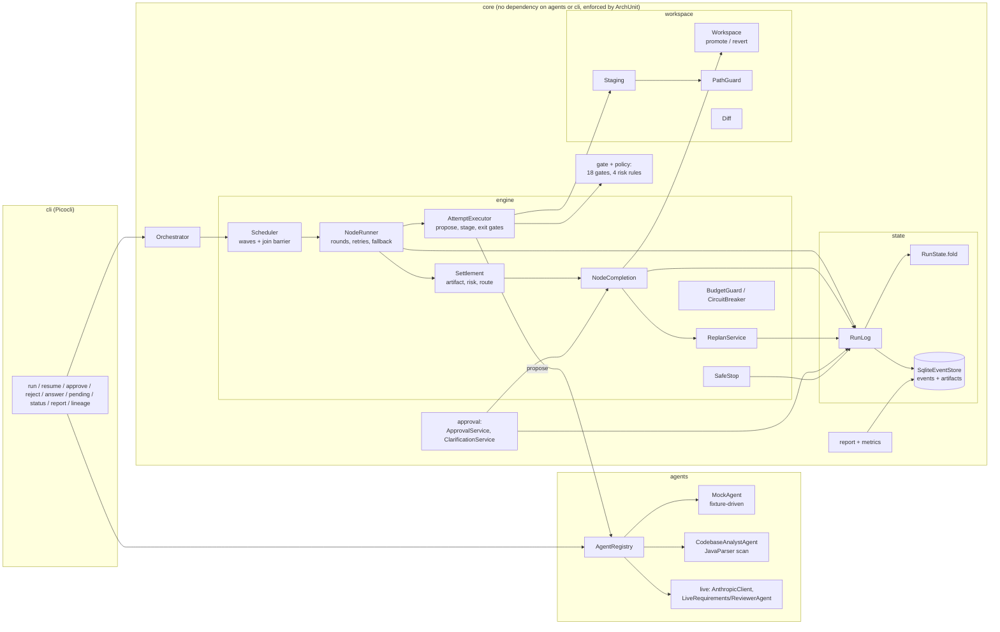

# Architecture

## Components



| Package | Responsibility |
|---|---|
| `core.graph` | `Node`, `WorkflowGraph`, `GraphValidator` (ids, references, retries, budgets, cycles named via Kahn plus DFS), `GraphPatch`, `WorkflowLoader` (YAML; unknown fields rejected) |
| `core.state` | `Event`/`EventType`, sealed `Payload` (one record per event type), `EventStore` and `ArtifactStore` (SQLite, insert-only), `RunState` (pure fold), `RunLog` (single write path), `Hashing` |
| `core.engine` | `Engine` (composition root), `RunLock`, `Scheduler`, `NodeRunner`, `AttemptExecutor`, `Settlement`, `GateRunner`, `NodeCompletion`, `ReplanService`, `SafeStop`, `BudgetGuard`, `CircuitBreaker`, `ArtifactRecorder`, `RunPaths`, `Clarifications` |
| `core.gate` | `Gate`, `GateContext`, sealed `GateResult`, `GateRegistry`, quality and build gates, `BuildRunner` (timeout, stripped environment, and a network-less container sandbox when Docker is available), `FailureSignature` |
| `core.policy` | `PolicyConfig`, security and compliance gates, `RiskRule` with `MigrationPathRule`, `PomChangeRule`, `DiffSizeRule` and `DeletionRule` |
| `core.approval` | `ApprovalService` (hash-bound approve and reject), `ClarificationService` (answers, finalization, re-fold) |
| `core.workspace` | `Workspace` (promote/revert under a read-write lock), `Staging`, `PathGuard`, `Diff`, `FileTrees` |
| `core.metrics`, `core.report` | `MetricsCalculator`/`RunMetrics`; `ReportWriter` (an ordered list of `ReportSection`s), `EventDescriber`, `MermaidRenderer`, `LineageWalker`, `IncidentWriter` |
| `agents` | `AgentRegistry`, `MockAgent`, `CodebaseAnalystAgent`; `scan/` holds `JavaCodebaseScanner`, `CodebaseScan` and the `ImpactReasoner` seam; `live/` holds the Anthropic Messages API client, `LiveRequirementsAgent`, `LiveReviewerAgent`, `LiveAnalystReasoner` and `LiveBuilderAgent` (architect, developer, tester, docs). ArchUnit keeps these packages free of cycles |
| `cli` | One Picocli command per operation, a console trace, and exit codes |

## Orchestration model

- **Workflows are data (R7).** A `workflow.yaml` declares nodes with `agent`, `dependsOn`, `entryGates`, `exitGates`, `autonomy`, `maxRetries`, `fallbackAgent` and `fixtureVariantFrom`. One generic engine runs all three scenarios, and no scenario name appears in `core`.
- **Explicit DAG.** The loader rejects duplicate ids, unknown dependencies, gates or agents, negative retries, unknown fields, and cycles. For a cycle it names the members, for example `dependency cycle: a -> b -> c -> a`.
- **Waves with a join barrier.** Each scheduler iteration computes every READY node (PENDING, with all dependencies DONE), runs them concurrently on a virtual-thread executor, and `join`s them. It then re-reads state from the log and re-checks budgets. A join node such as `review` in greenfield becomes READY only when all four of its dependencies are DONE.
- **Pausing is per branch.** A node awaiting a human does not stop independent branches. `RUN_PAUSED` (exit 10) is emitted only once nothing else can run.
- **Stateful and non-linear.** The graph itself can change at runtime (a graph patch). Completed work can also become stale (hash invalidation), in which case it is reverted and re-executed with the new inputs.

## Control flow of one node

```mermaid
sequenceDiagram
  participant S as Scheduler
  participant R as NodeRunner
  participant A as Agent
  participant W as Workspace/Staging
  participant G as Gates
  participant C as NodeCompletion
  S->>R: run(node) [in a wave]
  R->>R: NODE_STARTED(inputHash)
  R->>G: entry gates (fail = blocking: NODE_FAILED + SAFE_STOP)
  loop attempts (bounded)
    R->>R: budget check
    R->>A: propose(context: requirement, upstream artifacts only, answers, feedback)
    A-->>R: Proposal (files, rationale, derivedFrom, data)
    R->>R: AGENT_CALLED(promptHash, responseHash)
    R->>W: stage copy of workspace; PathGuard every path; apply
    R->>G: exit gates in order (first failure stops)
    alt all pass
      R->>R: artifact hash, risk rules on the diff
      alt blocking question unanswered
        R->>R: CLARIFICATION_REQUESTED (staging retained)
      else APPROVE_AFTER, or ESCALATE_ON_RISK with a flag
        R->>R: APPROVAL_REQUESTED(hash, reasons, diff) (staging retained)
      else
        R->>C: promote files, NODE_DONE, graph patch, invalidation if hash changed
      end
    else failure
      R->>W: discard staging (workspace untouched)
      R->>R: ATTEMPT_DISCARDED(signature); feedback = failure text
      R->>R: circuit breaker / retries / one fallback round / NODE_FAILED + SAFE_STOP
    end
  end
```

The algorithm is in [NodeRunner.java](../orchestrator/src/main/java/com/example/agentic/core/engine/NodeRunner.java); one attempt is [AttemptExecutor.java](../orchestrator/src/main/java/com/example/agentic/core/engine/AttemptExecutor.java) and settling an accepted attempt is [Settlement.java](../orchestrator/src/main/java/com/example/agentic/core/engine/Settlement.java).

- `maxRetries = 2` allows at most 3 attempts per agent.
- The **circuit breaker** stops an agent after two consecutive failures with the same normalized signature (absolute paths, timestamps, line numbers and durations are stripped before hashing).
- The **fallback** agent gets exactly one round, with its own retries and breaker.
- The attempt number an agent sees is counted per *(node, agent, input hash)*. After a human rejection the inputs are the same, so the agent sees attempt N+1 together with the rejection comment. After an upstream change, numbering starts at 1 again.

## State model (event sourcing)

- `events(seq, run_id, node_id, type, actor, input_hash, output_hash, ts, details_json)` is insert-only. The DAO has no update or delete, and SQLite `BEFORE UPDATE`/`BEFORE DELETE` triggers abort any attempt to mutate a row.
- Every event body is a record of the sealed `Payload` interface (for example `Payload.GateFailed(gate, phase, reason, signature)`). Writers build the record and readers pattern-match on it, so `RunState.apply` is an exhaustive `switch` and a misspelled key does not compile. `details_json` is the record's JSON form. Decoding rejects unknown fields, and `RunLog` decodes each event *before* persisting it, so an event the fold cannot read never reaches the log.
- `artifacts(hash, node_id, derived_from_json, rationale, content_json)` is content-addressed. The artifact hash is the SHA-256 of canonical JSON (sorted keys) of `{files, data}`; rationale and lineage are stored but not hashed.
- `RunState.fold(events)` derives node statuses, attempt counters, answers and questions, pending and approved hashes, budget usage, and active time. `RUN_STARTED` carries the full graph, and `REPLAN` events carry patches, so the fold also reconstructs the *current* graph. The live engine applies each appended event through the same reducer, and a test asserts that `fold(persisted events)` equals the live state.
- One process changes a run at a time: `start`, `resume`, approvals and answers take `RunLock`, an OS file lock on `runs/<id>/run.lock` (ADR-15). Reads never lock.
- `resume` rebuilds from the log. It resets nodes left RUNNING by a crash (and FAILED/SKIPPED after a safe-stop) to PENDING, and never re-runs a DONE node.

## Governance model

| Mechanism | Where | What it guarantees |
|---|---|---|
| Autonomy levels | `Node.autonomy` | `AUTO`, `APPROVE_AFTER` (always a human), `ESCALATE_ON_RISK` (a human only if a risk rule fires) |
| Risk rules | `policy/*Rule` | Migration paths, any `pom.xml` change, diffs over 200 changed lines, any deletion |
| Hash-bound approvals | `ApprovalService` | Approval applies to the hash in the latest `APPROVAL_REQUESTED`. The retained staged files are re-hashed, and a stale `--hash` or tampered files raise `StaleApprovalException`. `--by` is mandatory. |
| Change control | `PathGuard`, `path-allowlist` | Per-agent globs from `policies.yaml`; `..`, absolute paths, symlinks and out-of-scope paths are rejected before anything is written |
| Security gates | `secret-scan`, `forbidden-api`, `dependency-allowlist` | Scan added lines for credentials, block process execution, deserialization, reflective loading and script engines in `src/main/**`, and allow only allowlisted Maven dependencies, build plugins and parent POMs (no new repositories or build extensions) before any build runs |
| Compliance gates | `artifact-metadata`, `no-raw-ip-logging` | Rationale plus real lineage on every artifact; no client addresses in log calls |
| Evidence gates (ADR-20) | `requirements-complete`, `design-diagrams`, `review-complete`, `functional-coverage`, `test-coverage` | User stories; a Mermaid diagram in every design document; a review that covers every submitted file and resolves every finding; every acceptance criterion mapped to existing tests; line and branch coverage measured with JaCoCo in the sandbox against a 100% target, every class below it named |
| Workspace git history (ADR-21) | `GitHistory` | Every promotion and revert is one commit, authored by the agent role, with the rationale and `Approved-by` trailers; `NODE_DONE` records the commit; agents can never write `.git` |
| Build sandbox | `BuildRunner` (R10) | `mvn` runs in the staging dir with a 120 s timeout (the process tree is killed), a bounded `MAVEN_OPTS`, and an environment stripped to `PATH`, `JAVA_HOME` and `HOME` |
| Budgets | `RunBudgets` | `maxTotalAttempts`, `maxAgentCalls`, and `maxWallClockSeconds` measured on active time, so waiting for humans is excluded |
| Audit | event log and `report.md` | Who, what, when and which hash for every decision; decision lineage back to the requirement |

## Failure handling

| Failure | Response |
|---|---|
| Gate fails, or the agent throws | Staging discarded, so the workspace stays byte-identical. `ATTEMPT_DISCARDED` records the signature, and the failure text becomes the next attempt's feedback |
| Same failure twice in a row | Circuit breaker opens; the fallback agent (if any) gets one round |
| Retries and fallback exhausted, entry gate fails, or budget exceeded | `NODE_FAILED` and `SAFE_STOP`: every non-DONE node becomes SKIPPED, DONE nodes stay DONE, `incident.md` is written, exit code 20 |
| Parallel branches fail together | Starting, failing and settling are atomic under the `SafeStop` monitor. The first failure stops the run; other branches discard their staging, never start after the stop, and end SKIPPED |
| Promotion or revert conflict (a file changed underneath) | Hard failure followed by safe-stop. The engine never overwrites work it did not stage from |
| Process crash | Events are durable; `resume` continues from the log |

## Dynamic re-planning

1. **Hash invalidation** ([ReplanService](../orchestrator/src/main/java/com/example/agentic/core/engine/ReplanService.java)). When a node's artifact hash differs from its previous DONE hash, every non-PENDING downstream node (transitively) gets `INVALIDATED`. For each one, its promoted files are reverted from the stored pre-images (newest first), pending work is discarded, and its approval is revoked. One `REPLAN` event summarizes the cascade. Clarification answers are folded into the requirements artifact, so changing an answer is simply a hash change.
2. **Graph patch.** An agent may return `data.graphPatch = {addNodes, removeEdges, addEdges, reason}`. The patch is validated before promotion: it must stay acyclic, use only known agents and gates, and leave the dependencies of settled nodes (DONE, RUNNING, AWAITING) unchanged. It is then recorded as `REPLAN`, and `RunState` folds it into the graph.

## Traceability: assignment requirement → component → test

| Assignment requirement | Component | Evidence (test) |
|---|---|---|
| 1. Requirement understanding, ambiguity | requirements agent, `requirements-complete`, `ClarificationService` | `InvalidationTest.blockingQuestionPauses...`, `AmbiguousScenarioTest` |
| 2. Task decomposition with dependencies | `workflow.yaml`, `GraphValidator`, `WorkflowGraph` | `WorkflowLoaderTest`, `SchedulerTest` |
| 3. Codebase reasoning (brownfield) | `CodebaseAnalystAgent`, `JavaCodebaseScanner`, `impact-files-exist` | `JavaCodebaseScannerTest`, `BrownfieldScenarioTest` |
| 4. Orchestration: DAG, entry/exit gates, sequential and parallel paths | `Scheduler`, `NodeRunner`, `GateRegistry` | `SchedulerTest`, `SchedulerPropertyTest`, `GreenfieldScenarioTest` |
| 4. Cross-stage context and decision lineage | `AgentContext.upstream`, `Artifact.derivedFrom`, `LineageWalker` | `SchedulerTest` (upstream isolation), `QualityGatesTest` (lineage gate), reports |
| 4. Human approval checkpoints | `ApprovalService`, autonomy levels, risk rules | `ApprovalServiceTest`, `PolicyGatesTest.riskRulesHitAndMiss` |
| 4. Bounded retries, fallback, rollback, safe-stop | `NodeRunner`, `CircuitBreaker`, `Staging`, `SafeStop` | `RecoveryTest`, `WorkspaceTest`, `DurabilityTest`, `ResilienceScenarioTest` |
| 4. Security, compliance, change-control guardrails | `core.policy`, `PathGuard`, `BuildRunner` | `PolicyGatesTest`, `PathGuardTest`, `BuildRunnerTest` |
| 4. Audit-grade observability | `SqliteEventStore` (insert-only), `ReportWriter` | `SqliteEventStoreTest`, `DurabilityTest.foldOfPersistedEvents...` |
| 4. Reliability metrics | `MetricsCalculator` | `MetricsCalculatorTest` |
| 4. Dynamic re-planning | `ReplanService` | `InvalidationTest`, `GraphPatchTest`, `AmbiguousScenarioTest`, `BrownfieldScenarioTest` |
| 5. Production-quality outputs | `shortener-service` and fixtures, compiled and tested by real gates | shortener suite (161 tests); `GreenfieldScenarioTest` proves the baseline equals the greenfield output |
| 6. Validation and risk control | gates, risk rules, budgets | see the rows above |
| 7. Controlled autonomy | `Autonomy`, `--by`, hash binding | `ApprovalServiceTest`, demo scripts |
| 8. Final engineering summary | [system-engineering-summary.md](system-engineering-summary.md) (orchestrator), [engineering-summary.md](engineering-summary.md) (service) | n/a |
| Requirements: user stories and acceptance criteria | requirements agent, `requirements-complete` | `QualityGatesTest`, `GreenfieldScenarioTest` |
| Design: design document with diagrams | architect agent, `design-diagrams` | `EvidenceGatesTest`, all design fixtures |
| Development: error handling, logging, auditing, git history | shortener `ApiExceptionHandler`, `LogSanitizer`, `AuditFilter`; engine `GitHistory` | `ApiExceptionHandlerTest`, `AuditTrailIntegrationTest`, `GitHistoryTest`, `GreenfieldScenarioTest` |
| Code review: all code reviewed, issues and resolutions | reviewer agent, `review-complete`, report Quality evidence | `EvidenceGatesTest`, `GreenfieldScenarioTest` (55 of 55 files) |
| QA: unit tests, coverage reports, functional coverage, gaps named | tester `qa_report`, `test-coverage`, `functional-coverage`, `docs/coverage.md` | `EvidenceGatesTest`, `GreenfieldScenarioTest`, JaCoCo floors in both builds |
