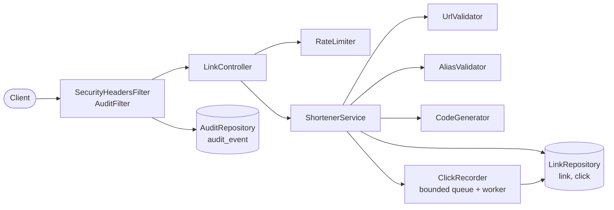
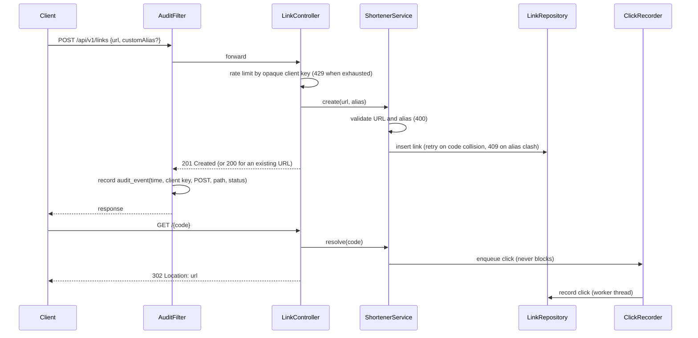

# URL Shortener v1: Design

## Scope

Create short links, redirect through them, and report aggregate click statistics. Link expiry is out of scope for v1.

## Components

| Package | Responsibility |
|---|---|
| `api` | HTTP adapter (`LinkController`), request/response records, error envelope (`ApiExceptionHandler`), opaque client keys, response headers and the audit filter |
| `service` | Business rules: `ShortenerService`, `UrlValidator`, `AliasValidator`, `CodeGenerator`, `RateLimiter`, `ClickRecorder` |
| `domain` | Immutable records: `ShortLink`, `LinkStats`, `DailyClicks` |
| `storage` | `LinkRepository` and `AuditRepository` ports and their JDBC implementations |

## Data model (Flyway `V1__init.sql`)

- `link(code PK, url, url_hash UNIQUE, created_at)`: `url_hash` is the SHA-256 of the normalized URL and makes creation idempotent.
- `click(id PK, code FK -> link, clicked_at)`: indexed on `(code, clicked_at)` for per-link aggregation.
- `audit_event(id PK, occurred_at, client_key, method, path, status)`: one row per state-changing request, indexed on `occurred_at`. `client_key` is the same opaque hash the rate limiter uses, never a raw address.
- Timestamps are stored as UTC wall-clock values, so per-day buckets are UTC days.

## Key decisions

1. **Uniqueness is enforced by the database.** Generated codes are inserted directly. A duplicate-key error on the code triggers a retry, with at most 5 attempts before `CODE_GENERATION_FAILED`. A duplicate on `url_hash` means a concurrent create won, and its link is returned.
2. **Codes** are 7 base62 characters from `SecureRandom`, giving about 3.5e12 codes, so collisions are rare.
3. **URL validation happens at creation.** It enforces http/https, a 2048-character limit, a required host and no credentials, and rejects `localhost`, `*.local`, and literal IPs in loopback, link-local, unspecified, private or ambiguous numeric forms. Host names are **not** resolved, so DNS rebinding is a known limitation.
4. **Redirects never wait on analytics.** Clicks go into a bounded in-memory queue (10,000 entries) that one worker drains. On overflow the click is dropped and counted.
5. **Rate limiting** uses an in-memory token bucket per client key, 20 creates per minute by default. The key is a truncated SHA-256 of the remote address, and raw IPs are never logged.
6. **Errors** are always `{"error":{"code","message"}}` with stable UPPER_SNAKE codes and no internal details.
7. **Hosts must be ASCII.** Internationalized names arrive as punycode, so Unicode case mapping can never turn a look-alike host into `localhost`.
8. **Every response is `Cache-Control: no-store` and `X-Content-Type-Options: nosniff`.** A cached redirect would bypass click recording and expiry, and cached stats would go stale.
9. **Dependencies are patched past Spring Boot's managed versions where CVEs exist** (Tomcat, Jackson, Log4j API). The CycloneDX SBOM is packaged at `META-INF/sbom/application.cdx.json`.
10. **Every state-changing request is audited.** `AuditFilter` records each `POST`, `PUT`, `PATCH` or `DELETE`, including rejected ones (400, 409, 429), with its time, opaque client key, method, path and final status. An audit write failure is logged and does not fail the request, because the response is already decided when the row is written.

## Diagrams

Components and their dependencies:

Creating a link, then following it:

## Risks

| Risk | Mitigation |
|---|---|
| SSRF via redirect targets | Literal-IP and local-name checks; DNS rebinding documented as out of scope |
| Click loss on crash or overflow | Accepted for analytics; drops are counted |
| Rate limiter is per instance | Acceptable for single-instance v1; a shared store is needed to scale out |
| Host-header injection into `shortUrl` | Set `shortener.base-url` in production |
