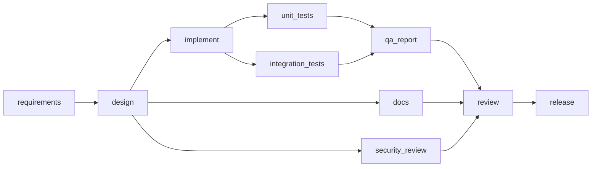

# Agentic Orchestration

This document explains the orchestration model as implemented in `orchestrator/`. Component structure, the per-node sequence diagram, the event-sourcing schema and the requirement-to-test traceability table are in [architecture.md](architecture.md). The reasoning behind each choice is in [decisions.md](decisions.md) (ADR-01 to ADR-21).

## Principle

**Agents propose; the engine disposes; humans approve.** An agent never writes to the workspace. It returns a `Proposal` (files, rationale, lineage, data). The engine stages it, checks paths, runs gates, and only then promotes it. Every step is appended to an insert-only SQLite event log, and all run state is a fold over that log.

## What runs

One generic engine executes any `workflow.yaml`. A workflow is a DAG of nodes; each node names an agent, its dependencies, entry and exit gates, an autonomy level and a retry bound. No scenario name appears in `core`.

| Scenario | Workflow | What it demonstrates |
|---|---|---|
| Greenfield | [scenarios/greenfield/workflow.yaml](../scenarios/greenfield/workflow.yaml) | 10 nodes, 2 parallel waves, 2 joins, 3 human checkpoints |
| Brownfield | [scenarios/brownfield/workflow.yaml](../scenarios/brownfield/workflow.yaml) | Codebase analysis; the analyst inserts a `db_migration` node at runtime (graph patch) |
| Ambiguous | [scenarios/ambiguous/workflow.yaml](../scenarios/ambiguous/workflow.yaml) | Blocking clarification; changing the answer invalidates and re-runs downstream nodes |
| Bugfix | [scenarios/bugfix/workflow.yaml](../scenarios/bugfix/workflow.yaml) | Reproduce-before-fix, behaviour-preserving refactor |

### Agent roles

Seven roles are registered in `AgentRegistry`: `requirements`, `analyst`, `architect`, `developer`, `tester`, `reviewer`, `docs`. Each has its own write scope in [policies/policies.yaml](../policies/policies.yaml) (`pathScopes`); an agent with no entry cannot write at all. `analyst` performs a real JavaParser scan of the codebase; the others are fixture-driven `mock-*` agents by default and model-backed in LIVE mode, each with a fixture agent of identical scope as fallback.

## Greenfield dependency graph



`unit_tests` and `integration_tests` run in parallel, as do `docs` and `security_review` alongside the `implement` branch. `qa_report` and `review` are join nodes: they become READY only when every dependency is DONE.

## Execution model

- **Waves with a join barrier.** Each scheduler iteration finds every READY node (PENDING with all dependencies DONE), runs them concurrently on virtual threads, joins, then re-reads state from the log and re-checks budgets.
- **Per-branch pausing.** A node waiting for a human does not block independent branches. The run pauses (exit 10) only when nothing else can run.
- **Entry and exit gates.** Entry gates must pass before the agent is called; exit gates run against the staged result, in order, and the first failure stops the attempt.
- **Cross-stage context.** An agent receives the requirement, its *upstream* artifacts only, clarification answers, and feedback from a failed prior attempt. Every artifact records `derivedFrom`, giving decision lineage back to the requirement (`orchestrator lineage`).

## Autonomy levels

| Level | Behaviour |
|---|---|
| `AUTO` | Promoted once all exit gates pass |
| `ESCALATE_ON_RISK` | Human approval only if a risk rule fires: migration path, any `pom.xml` change, diff over 200 changed lines, or any deletion |
| `APPROVE_AFTER` | Always waits for a human |

Approvals are hash-bound: they apply to the artifact hash in the latest `APPROVAL_REQUESTED`, the retained staged files are re-hashed, and a stale hash or tampered files are refused. `--by` is mandatory, so every decision has a named owner.

## Failure handling: retry, fallback, rollback, safe-stop

| Situation | Response |
|---|---|
| Gate fails or agent throws | Staging is discarded (workspace untouched, this is the rollback), `ATTEMPT_DISCARDED` records a normalized failure signature, and the failure text becomes feedback for the next attempt |
| Bounded retries | `maxRetries` per node (`2` allows 3 attempts) |
| Same signature twice in a row | Circuit breaker opens for that agent |
| Breaker open or retries exhausted, fallback defined | The fallback agent gets exactly one round with its own retries |
| Retries and fallback exhausted, entry gate fails, or a budget is exceeded | `NODE_FAILED` then `SAFE_STOP`: non-DONE nodes become SKIPPED, DONE nodes stay DONE, `incident.md` is written, exit code 20 |
| Parallel branches fail together | First failure wins atomically under the `SafeStop` monitor; other branches discard staging and end SKIPPED |
| A file changed underneath a promotion or revert | Hard failure and safe-stop; the engine never overwrites work it did not stage from |
| Process crash | Events are durable; `resume` rebuilds from the log, resets RUNNING nodes to PENDING and never re-runs a DONE node |

Budgets (`maxTotalAttempts`, `maxAgentCalls`, `maxWallClockSeconds` on active time, excluding human wait) come from `policies.yaml` and can be overridden per workflow.

Exit codes: `0` completed, `10` paused awaiting a human, `20` safe-stopped, `2` usage or validation error.

## Dynamic re-planning

1. **Hash invalidation.** When a node's artifact hash differs from its previous DONE hash, every non-PENDING downstream node is `INVALIDATED` transitively. Promoted files are reverted from stored pre-images (newest first), pending work is discarded, and approvals are revoked. One `REPLAN` event summarizes the cascade. Clarification answers are folded into the requirements artifact, so changing an answer is just a hash change.
2. **Graph patch.** An agent may return `data.graphPatch = {addNodes, removeEdges, addEdges, reason}`. It is validated before promotion (acyclic, known agents and gates, dependencies of settled nodes unchanged), recorded as `REPLAN`, and folded into the current graph. The brownfield analyst uses this to insert `db_migration`.

## Policy guardrails

| Category | Mechanism |
|---|---|
| Change control | `PathGuard` and `path-allowlist` gate: per-agent globs; `..`, absolute paths, symlinks and out-of-scope paths are rejected before anything is written |
| Security | `secret-scan`, `forbidden-api` (process exec, deserialization, reflective loading, script engines), `dependency-allowlist` and `buildAllowlist` (dependencies, plugins and parent POMs; repositories and build extensions always refused) |
| Compliance | `no-raw-ip-logging`, `artifact-metadata` (rationale and lineage on every artifact) |
| Evidence | `requirements-complete`, `design-diagrams`, `review-complete`, `functional-coverage`, `test-coverage` (JaCoCo against a 100% target, every class below it named) |
| Build sandbox | Gate builds run in a network-less container when Docker is available, with a 120 s timeout, bounded `MAVEN_OPTS` and a stripped environment |

## Observability and reliability metrics

Every fact is one of 20 `EventType`s in an insert-only table (SQLite triggers abort UPDATE and DELETE). `report.md` and the metrics are derived only from that log. `MetricsCalculator` reports:

| Metric | Definition |
|---|---|
| Success rate | Nodes DONE with no failed gate or discarded attempt, over all nodes |
| Retries and rollbacks | Discarded attempts, in total and per node (every discard is a staging rollback) |
| Fallbacks | Fallback-agent rounds |
| MTTR | Mean time from a node's first failure to its next DONE |
| End-to-end latency | Gross (run start to last completion), human wait, and net (gross minus human wait) |
| Governance counts | Approvals requested, granted, rejected; clarifications; invalidations; replans |
| Gate failures | Count per gate id |
| Model usage | Calls, tokens and model time (zero in MOCK runs) |

Definitions and rationale: ADR-11.

## Running it

```bash
make build            # verify the baseline, package the orchestrator
make demo-all         # all four scenarios in MOCK mode with real gates
scripts/live-run.sh scenarios/greenfield/workflow.yaml   # interactive LIVE run (needs ANTHROPIC_API_KEY, ANTHROPIC_MODEL)
```

`java -jar orchestrator/target/orchestrator.jar` exposes `run`, `status`, `pending`, `approve`, `reject`, `answer`, `resume`, `report` and `lineage`.
