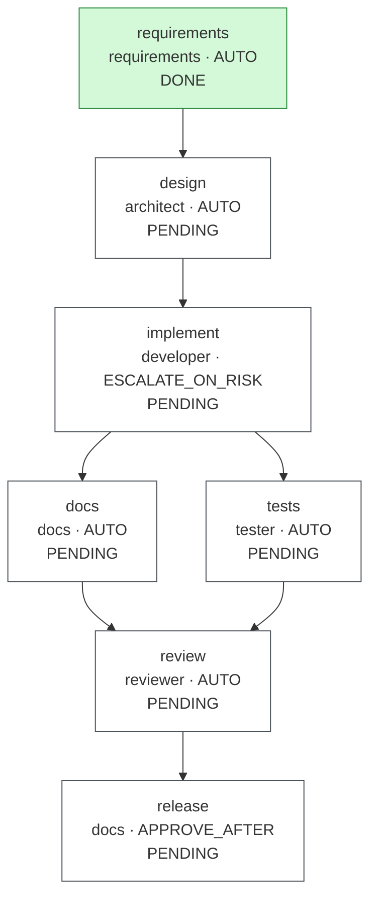
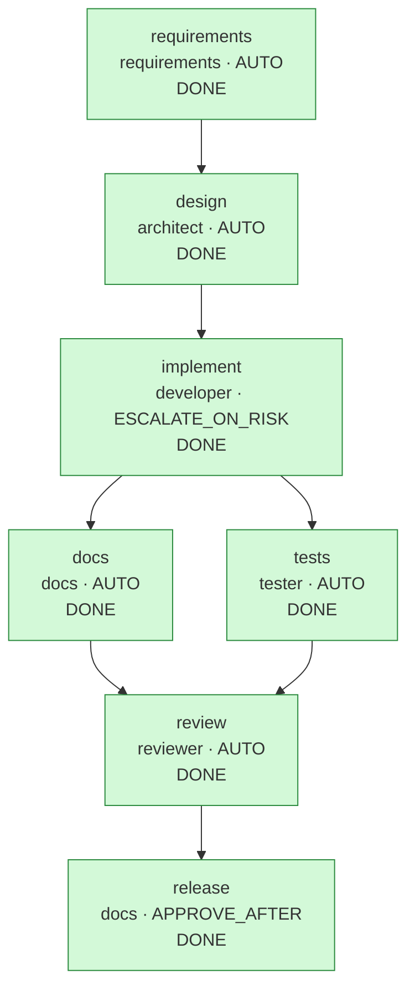

# Run report: `ambiguous-20260930-194522`

## Run summary

| | |
|---|---|
| Workflow | ambiguous |
| Requirement | Make links more secure and add some analytics. |
| Status | **COMPLETED** |
| Exit reason | all 7 nodes DONE |
| Events | 120 |
| Agent calls / attempts | 13 / 13 |

## Clarifications and assumptions

| Question | Blocking | Answer |
|---|---|---|
| `q-secure` What does 'more secure' mean for this service? | true | domain-blocklist |

Recorded assumptions (`requirements`):

- Clients already using https URLs must not be affected by the change
- q-analytics: click counts and daily buckets, no personal data (already provided by v1 stats; no referrer or IP collection)

## Workflow graph

### Before re-plan (state just before seq 69)

### After (final)

## Timeline

| Seq | Time (UTC) | Node | Event | Actor | Detail |
|---:|---|---|---|---|---|
| 1 | 19:45:23.257 |  | RUN_STARTED | engine | workflow ambiguous |
| 2 | 19:45:23.282 | requirements | NODE_STARTED | engine | agent requirements, variant default |
| 3 | 19:45:23.290 | requirements | AGENT_CALLED | requirements | requirements attempt 1 |
| 4 | 19:45:23.304 | requirements | GATE_PASSED | engine | artifact-metadata |
| 5 | 19:45:23.305 | requirements | GATE_PASSED | engine | requirements-complete |
| 6 | 19:45:23.309 | requirements | CLARIFICATION_REQUESTED | requirements | q-secure: What does 'more secure' mean for this service? |
| 7 | 19:45:23.313 |  | RUN_PAUSED | engine | waiting {requirements=AWAITING_CLARIFICATION} |
| 8 | 19:45:24.370 | requirements | ANSWERED | demo-reviewer | q-secure = https-only |
| 9 | 19:45:24.382 | requirements | NODE_DONE | demo-reviewer | artifact de232ac79401, 0 file(s) |
| 10 | 19:45:24.924 |  | RESUMED | engine |  |
| 11 | 19:45:24.935 | design | NODE_STARTED | engine | agent architect, variant https-only |
| 12 | 19:45:24.943 | design | AGENT_CALLED | architect | architect attempt 1 |
| 13 | 19:45:24.957 | design | GATE_PASSED | engine | artifact-metadata |
| 14 | 19:45:24.958 | design | GATE_PASSED | engine | design-diagrams |
| 15 | 19:45:24.959 | design | GATE_PASSED | engine | path-allowlist |
| 16 | 19:45:24.963 | design | GATE_PASSED | engine | schema-valid |
| 17 | 19:45:24.964 | design | GATE_PASSED | engine | secret-scan |
| 18 | 19:45:25.037 | design | NODE_DONE | engine | artifact fbbd7e7b7d70, 1 file(s), commit b846793cc286 |
| 19 | 19:45:25.044 | implement | NODE_STARTED | engine | agent developer, variant https-only |
| 20 | 19:45:25.044 | implement | GATE_PASSED | engine | path-allowlist |
| 21 | 19:45:25.046 | implement | AGENT_CALLED | developer | developer attempt 1 |
| 22 | 19:45:25.056 | implement | GATE_PASSED | engine | artifact-metadata |
| 23 | 19:45:25.057 | implement | GATE_PASSED | engine | path-allowlist |
| 24 | 19:45:25.059 | implement | GATE_PASSED | engine | secret-scan |
| 25 | 19:45:25.060 | implement | GATE_PASSED | engine | forbidden-api |
| 26 | 19:45:25.061 | implement | GATE_PASSED | engine | dependency-allowlist |
| 27 | 19:45:25.062 | implement | GATE_PASSED | engine | no-raw-ip-logging |
| 28 | 19:45:27.281 | implement | GATE_PASSED | engine | compile |
| 29 | 19:45:27.338 | implement | NODE_DONE | engine | artifact 3a70fd645bcf, 1 file(s), commit a69bcb376141 |
| 30 | 19:45:27.347 | docs | NODE_STARTED | engine | agent docs, variant https-only |
| 31 | 19:45:27.347 | tests | NODE_STARTED | engine | agent tester, variant https-only |
| 32 | 19:45:27.349 | tests | AGENT_CALLED | tester | tester attempt 1 |
| 33 | 19:45:27.349 | docs | AGENT_CALLED | docs | docs attempt 1 |
| 34 | 19:45:27.361 | docs | GATE_PASSED | engine | artifact-metadata |
| 35 | 19:45:27.361 | docs | GATE_PASSED | engine | path-allowlist |
| 36 | 19:45:27.362 | tests | GATE_PASSED | engine | artifact-metadata |
| 37 | 19:45:27.362 | tests | GATE_PASSED | engine | path-allowlist |
| 38 | 19:45:27.362 | docs | GATE_PASSED | engine | secret-scan |
| 39 | 19:45:27.362 | tests | GATE_PASSED | engine | secret-scan |
| 40 | 19:45:27.416 | docs | NODE_DONE | engine | artifact 4f72ce3eefd0, 1 file(s), commit a9ac5bc35f68 |
| 41 | 19:45:34.926 | tests | GATE_PASSED | engine | unit-tests |
| 42 | 19:45:34.983 | tests | NODE_DONE | engine | artifact 5dedcc0fc41d, 1 file(s), commit 528351a1f449 |
| 43 | 19:45:34.994 | review | NODE_STARTED | engine | agent reviewer, variant https-only |
| 44 | 19:45:34.995 | review | AGENT_CALLED | reviewer | reviewer attempt 1 |
| 45 | 19:45:35.006 | review | GATE_PASSED | engine | artifact-metadata |
| 46 | 19:45:35.007 | review | GATE_PASSED | engine | review-complete |
| 47 | 19:45:42.411 | review | GATE_PASSED | engine | regression-tests |
| 48 | 19:45:42.413 | review | NODE_DONE | engine | artifact 14d6b7b34fc0, 0 file(s) |
| 49 | 19:45:42.427 | release | NODE_STARTED | engine | agent docs, variant https-only |
| 50 | 19:45:42.427 | release | GATE_PASSED | engine | review-go |
| 51 | 19:45:42.428 | release | AGENT_CALLED | docs | docs attempt 1 |
| 52 | 19:45:42.440 | release | GATE_PASSED | engine | artifact-metadata |
| 53 | 19:45:42.440 | release | GATE_PASSED | engine | path-allowlist |
| 54 | 19:45:42.440 | release | GATE_PASSED | engine | secret-scan |
| 55 | 19:45:42.441 | release | APPROVAL_REQUESTED | engine | hash bee95a1ca6c8; [APPROVE_AFTER: human sign-off required] |
| 56 | 19:45:42.444 |  | RUN_PAUSED | engine | waiting {release=AWAITING_APPROVAL} |
| 57 | 19:45:42.990 | release | APPROVED | demo-reviewer | by demo-reviewer on bee95a1ca6c8: HTTPS-only policy approved |
| 58 | 19:45:43.048 | release | NODE_DONE | demo-reviewer | artifact bee95a1ca6c8, 1 file(s), commit dab6e0bede23 |
| 59 | 19:45:43.609 |  | RESUMED | engine |  |
| 60 | 19:45:43.614 |  | RUN_COMPLETED | engine |  |
| 61 | 19:45:44.162 | requirements | ANSWERED | demo-reviewer | q-secure = domain-blocklist |
| 62 | 19:45:44.173 | requirements | NODE_DONE | demo-reviewer | artifact 31e4d248c82b, 0 file(s) |
| 63 | 19:45:44.246 | design | INVALIDATED | engine | upstream requirements changed; reverted 1 file(s) |
| 64 | 19:45:44.249 | implement | INVALIDATED | engine | upstream requirements changed; reverted 1 file(s) |
| 65 | 19:45:44.249 | tests | INVALIDATED | engine | upstream requirements changed; reverted 1 file(s) |
| 66 | 19:45:44.249 | docs | INVALIDATED | engine | upstream requirements changed; reverted 1 file(s) |
| 67 | 19:45:44.250 | review | INVALIDATED | engine | upstream requirements changed; reverted 0 file(s) |
| 68 | 19:45:44.250 | release | INVALIDATED | engine | upstream requirements changed; reverted 1 file(s); approval revoked |
| 69 | 19:45:44.250 | requirements | REPLAN | engine | invalidation: artifact of 'requirements' changed |
| 70 | 19:45:45.370 |  | RESUMED | engine |  |
| 71 | 19:45:45.380 | design | NODE_STARTED | engine | agent architect, variant domain-blocklist |
| 72 | 19:45:45.388 | design | AGENT_CALLED | architect | architect attempt 1 |
| 73 | 19:45:45.403 | design | GATE_PASSED | engine | artifact-metadata |
| 74 | 19:45:45.404 | design | GATE_PASSED | engine | design-diagrams |
| 75 | 19:45:45.405 | design | GATE_PASSED | engine | path-allowlist |
| 76 | 19:45:45.409 | design | GATE_PASSED | engine | schema-valid |
| 77 | 19:45:45.410 | design | GATE_PASSED | engine | secret-scan |
| 78 | 19:45:45.467 | design | NODE_DONE | engine | artifact 6cfd200218a1, 1 file(s), commit cc4a6de49f89 |
| 79 | 19:45:45.474 | implement | NODE_STARTED | engine | agent developer, variant domain-blocklist |
| 80 | 19:45:45.474 | implement | GATE_PASSED | engine | path-allowlist |
| 81 | 19:45:45.477 | implement | AGENT_CALLED | developer | developer attempt 1 |
| 82 | 19:45:45.488 | implement | GATE_PASSED | engine | artifact-metadata |
| 83 | 19:45:45.489 | implement | GATE_PASSED | engine | path-allowlist |
| 84 | 19:45:45.491 | implement | GATE_PASSED | engine | secret-scan |
| 85 | 19:45:45.493 | implement | GATE_PASSED | engine | forbidden-api |
| 86 | 19:45:45.494 | implement | GATE_PASSED | engine | dependency-allowlist |
| 87 | 19:45:45.495 | implement | GATE_PASSED | engine | no-raw-ip-logging |
| 88 | 19:45:47.691 | implement | GATE_PASSED | engine | compile |
| 89 | 19:45:47.755 | implement | NODE_DONE | engine | artifact 0908780e9b79, 3 file(s), commit 800852c1ec9a |
| 90 | 19:45:47.764 | docs | NODE_STARTED | engine | agent docs, variant domain-blocklist |
| 91 | 19:45:47.765 | tests | NODE_STARTED | engine | agent tester, variant domain-blocklist |
| 92 | 19:45:47.766 | docs | AGENT_CALLED | docs | docs attempt 1 |
| 93 | 19:45:47.766 | tests | AGENT_CALLED | tester | tester attempt 1 |
| 94 | 19:45:47.779 | docs | GATE_PASSED | engine | artifact-metadata |
| 95 | 19:45:47.779 | docs | GATE_PASSED | engine | path-allowlist |
| 96 | 19:45:47.780 | docs | GATE_PASSED | engine | secret-scan |
| 97 | 19:45:47.780 | tests | GATE_PASSED | engine | artifact-metadata |
| 98 | 19:45:47.781 | tests | GATE_PASSED | engine | path-allowlist |
| 99 | 19:45:47.781 | tests | GATE_PASSED | engine | secret-scan |
| 100 | 19:45:47.838 | docs | NODE_DONE | engine | artifact 712ed297e61c, 1 file(s), commit e78c85bb40c4 |
| 101 | 19:45:55.490 | tests | GATE_PASSED | engine | unit-tests |
| 102 | 19:45:55.546 | tests | NODE_DONE | engine | artifact 9c6b4c515042, 2 file(s), commit 89a475da7d09 |
| 103 | 19:45:55.559 | review | NODE_STARTED | engine | agent reviewer, variant domain-blocklist |
| 104 | 19:45:55.561 | review | AGENT_CALLED | reviewer | reviewer attempt 1 |
| 105 | 19:45:55.574 | review | GATE_PASSED | engine | artifact-metadata |
| 106 | 19:45:55.575 | review | GATE_PASSED | engine | review-complete |
| 107 | 19:46:03.181 | review | GATE_PASSED | engine | regression-tests |
| 108 | 19:46:03.182 | review | NODE_DONE | engine | artifact 5e41ff19b1ac, 0 file(s) |
| 109 | 19:46:03.194 | release | NODE_STARTED | engine | agent docs, variant domain-blocklist |
| 110 | 19:46:03.194 | release | GATE_PASSED | engine | review-go |
| 111 | 19:46:03.195 | release | AGENT_CALLED | docs | docs attempt 1 |
| 112 | 19:46:03.206 | release | GATE_PASSED | engine | artifact-metadata |
| 113 | 19:46:03.206 | release | GATE_PASSED | engine | path-allowlist |
| 114 | 19:46:03.207 | release | GATE_PASSED | engine | secret-scan |
| 115 | 19:46:03.208 | release | APPROVAL_REQUESTED | engine | hash 55043e2f1f51; [APPROVE_AFTER: human sign-off required] |
| 116 | 19:46:03.209 |  | RUN_PAUSED | engine | waiting {release=AWAITING_APPROVAL} |
| 117 | 19:46:03.791 | release | APPROVED | demo-reviewer | by demo-reviewer on 55043e2f1f51: Domain blocklist approved |
| 118 | 19:46:03.849 | release | NODE_DONE | demo-reviewer | artifact 55043e2f1f51, 1 file(s), commit 23f1fa660646 |
| 119 | 19:46:04.430 |  | RESUMED | engine |  |
| 120 | 19:46:04.435 |  | RUN_COMPLETED | engine |  |

## Metrics

| Metric | Value |
|---|---|
| Success rate (first-pass DONE / nodes) | 100.0% (7/7) |
| Retries (discarded attempts) | 0 |
| Rollbacks (staging discarded) | 0 |
| Fallbacks | 0 |
| MTTR | n/a (no recovered failures) over 0 node(s) |
| End-to-end latency (gross) | 41.177 s |
| Human wait excluded | 3.948 s |
| End-to-end latency (net) | 37.229 s |
| Approvals requested / granted / rejected | 2 / 2 / 0 |
| Clarifications requested | 1 |
| Invalidations / replans | 6 / 1 |
| Gate failures by gate | none |

## Approvals

| Seq | Node | Decision | Who | When (UTC) | Hash approved | Comment | Revoked later |
|---:|---|---|---|---|---|---|---|
| 57 | release | APPROVED | demo-reviewer | 19:45:42.990 | `bee95a1ca6c8` | HTTPS-only policy approved | yes (INVALIDATED seq 68) |
| 117 | release | APPROVED | demo-reviewer | 19:46:03.791 | `55043e2f1f51` | Domain blocklist approved | no |

## Decision lineage

- **release** `55043e2f1f51`: Release notes for the domain blocklist.
  - **review** `5e41ff19b1ac`: Blocklist change is backwards compatible and tested at unit and API level; the full suite passes in this gate.
    - **tests** `9c6b4c515042`: Tests for blocklist matching (exact, subdomain, case, lookalikes) and end-to-end 400 for blocked hosts; v1 validator tests remain unchanged and must still pass.
      - **implement** `0908780e9b79`: Added DomainBlocklist (config-driven, subdomain-aware) and wired it into UrlValidator after the v1 checks; the no-arg constructor keeps v1 callers unchanged.
        - **design** `6cfd200218a1`: Operator-controlled domain blocklist checked at creation; backwards compatible for unblocked hosts.
          - **requirements** `31e4d248c82b`: The request mixes one ambiguous goal and one mostly-satisfied goal. 'Secure' has several incompatible readings with different costs and API impact, so it blo...
            - requirement: "Make links more secure and add some analytics."
    - **docs** `712ed297e61c`: Documents blocklist configuration, matching rules, the client-visible error, and the privacy stance of analytics.
      - **implement** `0908780e9b79` (see above)

Artifacts by node:

| Node | Artifact | Files | Rationale |
|---|---|---:|---|
| requirements | `31e4d248c82b` | 0 | The request mixes one ambiguous goal and one mostly-satisfied goal. 'Secure' has several incompatible readings with different costs and API impact, so it blocks until a human chooses. 'Some analytics' is already met by v1 aggregate stats... |
| design | `6cfd200218a1` | 1 | Operator-controlled domain blocklist checked at creation; backwards compatible for unblocked hosts. |
| implement | `0908780e9b79` | 3 | Added DomainBlocklist (config-driven, subdomain-aware) and wired it into UrlValidator after the v1 checks; the no-arg constructor keeps v1 callers unchanged. |
| tests | `9c6b4c515042` | 2 | Tests for blocklist matching (exact, subdomain, case, lookalikes) and end-to-end 400 for blocked hosts; v1 validator tests remain unchanged and must still pass. |
| docs | `712ed297e61c` | 1 | Documents blocklist configuration, matching rules, the client-visible error, and the privacy stance of analytics. |
| review | `5e41ff19b1ac` | 0 | Blocklist change is backwards compatible and tested at unit and API level; the full suite passes in this gate. |
| release | `55043e2f1f51` | 1 | Release notes for the domain blocklist. |

## Quality evidence

### User stories (`requirements`)

- As a visitor, I want short links to lead only to destinations the service considers safe, so that a short link cannot be used against me
- As a link owner, I want aggregate click analytics without personal data, so that I can measure usage without tracking people

Acceptance criteria: 3.

### Design documents

| Node | Document | Mermaid diagrams |
|---|---|---:|
| `design` | `docs/design-security.md` | 1 |

### Code review (`review`): GO

Reviewed 7 of 7 submitted files.

| Severity | File | Finding | Status | Resolution |
|---|---|---|---|---|
| MEDIUM | `src/main/java/com/example/shortener/service/DomainBlocklist.java` | Static list only; plan a reloadable source or reputation feed | ACCEPTED | Restart-to-reload is an accepted prototype trade-off in docs/design-security.md; a reloadable source is the planned follow-up. |

### Workspace git history

Each promotion is one commit in the run's workspace (`git log` there shows the rationale and trailers).

| Seq | Node | Commit | Files | Approved by |
|---|---|---|---:|---|
| 18 | `design` | `b846793cc286` | 1 | - |
| 29 | `implement` | `a69bcb376141` | 1 | - |
| 40 | `docs` | `a9ac5bc35f68` | 1 | - |
| 42 | `tests` | `528351a1f449` | 1 | - |
| 58 | `release` | `dab6e0bede23` | 1 | demo-reviewer |
| 78 | `design` | `cc4a6de49f89` | 1 | - |
| 89 | `implement` | `800852c1ec9a` | 3 | - |
| 100 | `docs` | `e78c85bb40c4` | 1 | - |
| 102 | `tests` | `89a475da7d09` | 2 | - |
| 118 | `release` | `23f1fa660646` | 1 | demo-reviewer |

## Policy and gate results

| Gate | Passed | Failed |
|---|---:|---:|
| artifact-metadata | 13 | 0 |
| compile | 2 | 0 |
| dependency-allowlist | 2 | 0 |
| design-diagrams | 2 | 0 |
| forbidden-api | 2 | 0 |
| no-raw-ip-logging | 2 | 0 |
| path-allowlist | 12 | 0 |
| regression-tests | 2 | 0 |
| requirements-complete | 1 | 0 |
| review-complete | 2 | 0 |
| review-go | 2 | 0 |
| schema-valid | 2 | 0 |
| secret-scan | 10 | 0 |
| unit-tests | 2 | 0 |

Failures:

- none

## Invalidation and replan history

| Seq | Event | Node | Detail |
|---:|---|---|---|
| 63 | INVALIDATED | design | upstream requirements changed; reverted 1 file(s) |
| 64 | INVALIDATED | implement | upstream requirements changed; reverted 1 file(s) |
| 65 | INVALIDATED | tests | upstream requirements changed; reverted 1 file(s) |
| 66 | INVALIDATED | docs | upstream requirements changed; reverted 1 file(s) |
| 67 | INVALIDATED | review | upstream requirements changed; reverted 0 file(s) |
| 68 | INVALIDATED | release | upstream requirements changed; reverted 1 file(s); approval revoked |
| 69 | REPLAN | requirements | cascade [design, implement, tests, docs, review, release] (de232ac79401 → 31e4d248c82b) |
