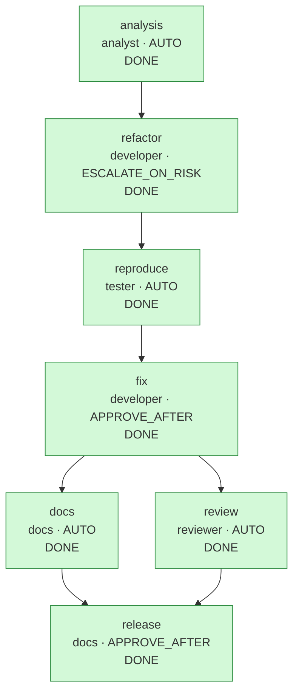

# Run report: `bugfix-20260930-194605`

## Run summary

| | |
|---|---|
| Workflow | bugfix |
| Requirement | Security bug report: POST /api/v1/links accepts http://localhost./admin and http://printer.local./, so a short link can redirect clients to local hosts. Fix it without changing any other behavior. |
| Status | **COMPLETED** |
| Exit reason | all 7 nodes DONE |
| Events | 71 |
| Agent calls / attempts | 8 / 8 |

## Clarifications and assumptions

No blocking questions were raised.

## Workflow graph

## Timeline

| Seq | Time (UTC) | Node | Event | Actor | Detail |
|---:|---|---|---|---|---|
| 1 | 19:46:05.701 |  | RUN_STARTED | engine | workflow bugfix |
| 2 | 19:46:05.726 | analysis | NODE_STARTED | engine | agent analyst, variant default |
| 3 | 19:46:05.931 | analysis | AGENT_CALLED | analyst | analyst attempt 1 |
| 4 | 19:46:05.946 | analysis | GATE_PASSED | engine | artifact-metadata |
| 5 | 19:46:05.948 | analysis | GATE_PASSED | engine | impact-files-exist |
| 6 | 19:46:05.959 | analysis | NODE_DONE | engine | artifact 5d57bdb5474c, 0 file(s) |
| 7 | 19:46:05.969 | refactor | NODE_STARTED | engine | agent developer, variant default |
| 8 | 19:46:05.970 | refactor | GATE_PASSED | engine | path-allowlist |
| 9 | 19:46:05.971 | refactor | AGENT_CALLED | developer | developer attempt 1 |
| 10 | 19:46:05.982 | refactor | GATE_PASSED | engine | artifact-metadata |
| 11 | 19:46:05.983 | refactor | GATE_PASSED | engine | path-allowlist |
| 12 | 19:46:05.986 | refactor | GATE_PASSED | engine | secret-scan |
| 13 | 19:46:05.987 | refactor | GATE_PASSED | engine | forbidden-api |
| 14 | 19:46:08.167 | refactor | GATE_PASSED | engine | compile |
| 15 | 19:46:15.387 | refactor | GATE_PASSED | engine | regression-tests |
| 16 | 19:46:15.463 | refactor | NODE_DONE | engine | artifact 114649da877e, 2 file(s), commit de0c8611203d |
| 17 | 19:46:15.475 | reproduce | NODE_STARTED | engine | agent tester, variant default |
| 18 | 19:46:15.480 | reproduce | AGENT_CALLED | tester | tester attempt 1 |
| 19 | 19:46:15.492 | reproduce | GATE_PASSED | engine | artifact-metadata |
| 20 | 19:46:15.492 | reproduce | GATE_PASSED | engine | path-allowlist |
| 21 | 19:46:15.492 | reproduce | GATE_PASSED | engine | secret-scan |
| 22 | 19:46:23.141 | reproduce | GATE_PASSED | engine | reproduces-defect |
| 23 | 19:46:23.201 | reproduce | NODE_DONE | engine | artifact d7604889ea84, 1 file(s), commit 139f9ca23812 |
| 24 | 19:46:23.212 | fix | NODE_STARTED | engine | agent developer, variant default |
| 25 | 19:46:23.213 | fix | GATE_PASSED | engine | path-allowlist |
| 26 | 19:46:23.214 | fix | AGENT_CALLED | developer | developer attempt 1 |
| 27 | 19:46:23.225 | fix | GATE_PASSED | engine | artifact-metadata |
| 28 | 19:46:23.225 | fix | GATE_PASSED | engine | path-allowlist |
| 29 | 19:46:23.225 | fix | GATE_PASSED | engine | secret-scan |
| 30 | 19:46:23.226 | fix | GATE_PASSED | engine | forbidden-api |
| 31 | 19:46:23.226 | fix | GATE_PASSED | engine | no-raw-ip-logging |
| 32 | 19:46:25.276 | fix | GATE_PASSED | engine | compile |
| 33 | 19:46:32.710 | fix | GATE_FAILED | engine | regression-tests: mvn test failed (exit 1): TrailingDotHostTest.absoluteNamesOfLocalHostsAreRejected:21 {"@timestamp":"2026-09-30T15:46:29.539637-04:00","message":"Audit event could not be recorded: IllegalStateException","logger_name":"... |
| 34 | 19:46:32.723 | fix | ATTEMPT_DISCARDED | engine | rolled back attempt 1 (regression-tests, sig 12e3dd0eb5df) |
| 35 | 19:46:32.726 | fix | AGENT_CALLED | developer | developer attempt 2 |
| 36 | 19:46:32.738 | fix | GATE_PASSED | engine | artifact-metadata |
| 37 | 19:46:32.738 | fix | GATE_PASSED | engine | path-allowlist |
| 38 | 19:46:32.738 | fix | GATE_PASSED | engine | secret-scan |
| 39 | 19:46:32.739 | fix | GATE_PASSED | engine | forbidden-api |
| 40 | 19:46:32.739 | fix | GATE_PASSED | engine | no-raw-ip-logging |
| 41 | 19:46:34.886 | fix | GATE_PASSED | engine | compile |
| 42 | 19:46:42.259 | fix | GATE_PASSED | engine | regression-tests |
| 43 | 19:46:42.262 | fix | APPROVAL_REQUESTED | engine | hash 24021f365dc4; [APPROVE_AFTER: human sign-off required] |
| 44 | 19:46:42.264 |  | RUN_PAUSED | engine | waiting {fix=AWAITING_APPROVAL} |
| 45 | 19:46:43.326 | fix | APPROVED | demo-reviewer | by demo-reviewer on 24021f365dc4: Root cause fixed in one place; reproduction test green |
| 46 | 19:46:43.389 | fix | NODE_DONE | demo-reviewer | artifact 24021f365dc4, 1 file(s), commit df5e40593641 |
| 47 | 19:46:43.964 |  | RESUMED | engine |  |
| 48 | 19:46:43.978 | review | NODE_STARTED | engine | agent reviewer, variant default |
| 49 | 19:46:43.979 | docs | NODE_STARTED | engine | agent docs, variant default |
| 50 | 19:46:43.986 | review | AGENT_CALLED | reviewer | reviewer attempt 1 |
| 51 | 19:46:43.988 | docs | AGENT_CALLED | docs | docs attempt 1 |
| 52 | 19:46:44.005 | review | GATE_PASSED | engine | artifact-metadata |
| 53 | 19:46:44.007 | docs | GATE_PASSED | engine | artifact-metadata |
| 54 | 19:46:44.007 | review | GATE_PASSED | engine | review-complete |
| 55 | 19:46:44.007 | docs | GATE_PASSED | engine | path-allowlist |
| 56 | 19:46:44.008 | docs | GATE_PASSED | engine | secret-scan |
| 57 | 19:46:44.073 | docs | NODE_DONE | engine | artifact 444dd207eed2, 1 file(s), commit 85f46ee33652 |
| 58 | 19:46:51.398 | review | GATE_PASSED | engine | regression-tests |
| 59 | 19:46:51.400 | review | NODE_DONE | engine | artifact 7ad3e5a74fdc, 0 file(s) |
| 60 | 19:46:51.413 | release | NODE_STARTED | engine | agent docs, variant default |
| 61 | 19:46:51.413 | release | GATE_PASSED | engine | review-go |
| 62 | 19:46:51.414 | release | AGENT_CALLED | docs | docs attempt 1 |
| 63 | 19:46:51.427 | release | GATE_PASSED | engine | artifact-metadata |
| 64 | 19:46:51.427 | release | GATE_PASSED | engine | path-allowlist |
| 65 | 19:46:51.427 | release | GATE_PASSED | engine | secret-scan |
| 66 | 19:46:51.429 | release | APPROVAL_REQUESTED | engine | hash 992a04595176; [APPROVE_AFTER: human sign-off required] |
| 67 | 19:46:51.430 |  | RUN_PAUSED | engine | waiting {release=AWAITING_APPROVAL} |
| 68 | 19:46:52.498 | release | APPROVED | demo-reviewer | by demo-reviewer on 992a04595176: Review GO, full suite green: release 1.0.1 |
| 69 | 19:46:52.556 | release | NODE_DONE | demo-reviewer | artifact 992a04595176, 1 file(s), commit ff029047a75d |
| 70 | 19:46:53.127 |  | RESUMED | engine |  |
| 71 | 19:46:53.133 |  | RUN_COMPLETED | engine |  |

## Metrics

| Metric | Value |
|---|---|
| Success rate (first-pass DONE / nodes) | 85.7% (6/7) |
| Retries (discarded attempts) | 1 {fix=1} |
| Rollbacks (staging discarded) | 1 |
| Fallbacks | 0 |
| MTTR | 10.678 s over 1 node(s) |
| End-to-end latency (gross) | 47.431 s |
| Human wait excluded | 2.133 s |
| End-to-end latency (net) | 45.298 s |
| Approvals requested / granted / rejected | 2 / 2 / 0 |
| Clarifications requested | 0 |
| Invalidations / replans | 0 / 0 |
| Gate failures by gate | {regression-tests=1} |

## Approvals

| Seq | Node | Decision | Who | When (UTC) | Hash approved | Comment | Revoked later |
|---:|---|---|---|---|---|---|---|
| 45 | fix | APPROVED | demo-reviewer | 19:46:43.326 | `24021f365dc4` | Root cause fixed in one place; reproduction test green | no |
| 68 | release | APPROVED | demo-reviewer | 19:46:52.498 | `992a04595176` | Review GO, full suite green: release 1.0.1 | no |

## Decision lineage

- **release** `992a04595176`: Release notes for 1.0.1 (security fix). Release readiness: reproduction test green, full regression suite green, review GO.
  - **review** `7ad3e5a74fdc`: Security review of the fix: root cause addressed in one place, reproduction test now green, refactor proven behavior-preserving by the unchanged suite, full ...
    - **fix** `24021f365dc4`: The first attempt special-cased the reported string, and the regression test showed api.localhost. and printer.local. still pass. The root cause is that ever...
      - **reproduce** `d7604889ea84`: Regression test written before the fix. It must fail on the current code (the reproduces-defect gate checks that it fails, compiles, and breaks nothing else)...
        - **analysis** `5d57bdb5474c`: The report reproduces on v1: java.net.URI keeps the trailing dot of an absolute DNS name, and the host rules compare exact strings, so localhost. and *.local...
          - requirement: "Security bug report: POST /api/v1/links accepts http://localhost./admin and http://printer.local./, so a short link can redirect clients to local hosts. Fix ..."
        - **refactor** `114649da877e`: Behavior-preserving extraction: host classification moves from UrlValidator into HostClassifier with identical logic (the defect included, on purpose), so th...
          - **analysis** `5d57bdb5474c` (see above)
      - **refactor** `114649da877e` (see above)
  - **docs** `444dd207eed2`: Documents the host rules, including the absolute-name case the fix covers, for API clients and reviewers.
    - **fix** `24021f365dc4` (see above)

Artifacts by node:

| Node | Artifact | Files | Rationale |
|---|---|---:|---|
| analysis | `5d57bdb5474c` | 0 | The report reproduces on v1: java.net.URI keeps the trailing dot of an absolute DNS name, and the host rules compare exact strings, so localhost. and *.local. pass while resolving to the same loopback or LAN hosts. The rules are private ... |
| refactor | `114649da877e` | 2 | Behavior-preserving extraction: host classification moves from UrlValidator into HostClassifier with identical logic (the defect included, on purpose), so the fix becomes a single-class change. The full existing suite runs unchanged in t... |
| reproduce | `d7604889ea84` | 1 | Regression test written before the fix. It must fail on the current code (the reproduces-defect gate checks that it fails, compiles, and breaks nothing else), and it also pins that public absolute names such as example.com. stay valid. |
| fix | `24021f365dc4` | 1 | The first attempt special-cased the reported string, and the regression test showed api.localhost. and printer.local. still pass. The root cause is that every rule sees the raw host: now the absolute-name trailing dot is removed once, em... |
| review | `7ad3e5a74fdc` | 0 | Security review of the fix: root cause addressed in one place, reproduction test now green, refactor proven behavior-preserving by the unchanged suite, full suite re-run in this gate. |
| docs | `444dd207eed2` | 1 | Documents the host rules, including the absolute-name case the fix covers, for API clients and reviewers. |
| release | `992a04595176` | 1 | Release notes for 1.0.1 (security fix). Release readiness: reproduction test green, full regression suite green, review GO. |

## Quality evidence

### Code review (`review`): GO

Reviewed 3 of 3 submitted files.

| Severity | File | Finding | Status | Resolution |
|---|---|---|---|---|
| LOW | `src/main/java/com/example/shortener/service/HostClassifier.java` | DNS rebinding remains out of scope (names are not resolved); unchanged documented limitation | ACCEPTED | Unchanged documented limitation; the fix neither widens nor narrows it. |

### Workspace git history

Each promotion is one commit in the run's workspace (`git log` there shows the rationale and trailers).

| Seq | Node | Commit | Files | Approved by |
|---|---|---|---:|---|
| 16 | `refactor` | `de0c8611203d` | 2 | - |
| 23 | `reproduce` | `139f9ca23812` | 1 | - |
| 46 | `fix` | `df5e40593641` | 1 | demo-reviewer |
| 57 | `docs` | `85f46ee33652` | 1 | - |
| 69 | `release` | `ff029047a75d` | 1 | demo-reviewer |

## Policy and gate results

| Gate | Passed | Failed |
|---|---:|---:|
| artifact-metadata | 8 | 0 |
| compile | 3 | 0 |
| forbidden-api | 3 | 0 |
| impact-files-exist | 1 | 0 |
| no-raw-ip-logging | 2 | 0 |
| path-allowlist | 8 | 0 |
| regression-tests | 3 | 1 |
| reproduces-defect | 1 | 0 |
| review-complete | 1 | 0 |
| review-go | 1 | 0 |
| secret-scan | 6 | 0 |

Failures:

- seq 33 `fix` / `regression-tests`: mvn test failed (exit 1): ⏎ {"@timestamp":"2026-09-30T15:46:29.539637-04:00","message":"Audit event could not be recorded: IllegalStateException","logger_name":"com.example.shortener.api.AuditFilter","thread_name":"main","level":"WARN"} ...

## Invalidation and replan history

| Seq | Event | Node | Detail |
|---:|---|---|---|
| | none | | |
