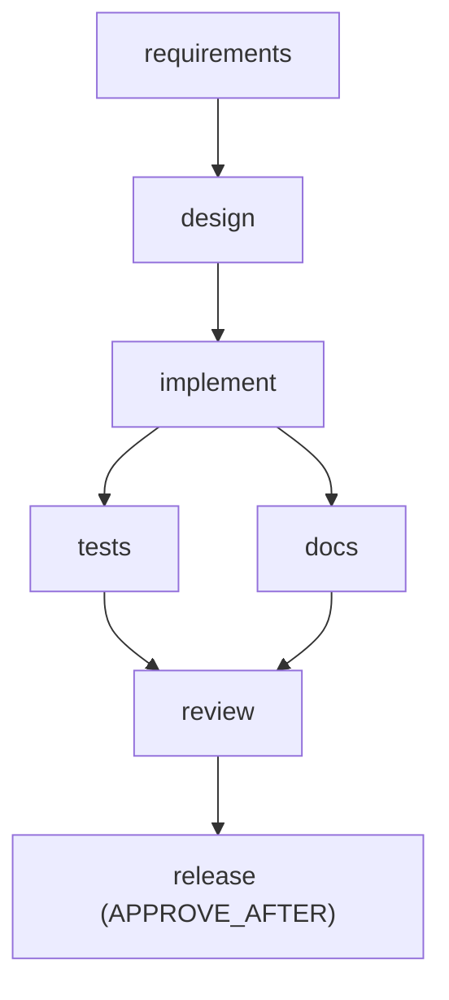

# Scenario: Ambiguous ("Make links more secure and add some analytics")

Run it with `make demo-ambiguous`. Full sample output: [sample-runs/ambiguous/report.md](../sample-runs/ambiguous/report.md). Definition: [scenarios/ambiguous/workflow.yaml](../../scenarios/ambiguous/workflow.yaml).

## Requirement

> Make links more secure and add some analytics.

The workspace is a copy of `shortener-service` (v1).

## Requirement understanding

The requirements agent normalizes the request and raises two ambiguities:

| Id | Question | Blocking | Handling |
|---|---|---|---|
| `q-secure` | What does "more secure" mean? Options: `https-only`, `domain-blocklist`, `authentication`, `abuse-prevention` | **yes** | The interpretations change the API incompatibly, so the node pauses (`AWAITING_CLARIFICATION`, exit 10) |
| `q-analytics` | Which analytics are needed beyond what exists? | no | Recorded assumption: "click counts and daily buckets, no personal data (already provided by v1 stats; no referrer or IP collection)" |

## Decomposition

Every node after `requirements` declares `fixtureVariantFrom: q-secure`, so the answer selects its fixtures, and the variant is part of each node's input hash.

## What happens

| Step | Events | Result |
|---|---|---|
| 1. run | CLARIFICATION_REQUESTED `q-secure`, RUN_PAUSED | exit 10 |
| 2. `answer q-secure "https-only"` | ANSWERED; the answer is folded into the requirements artifact; NODE_DONE `8b1a2275...` | |
| 3. resume | design, implement (compile), tests and docs (parallel), review (full suite), release pause | `UrlValidator` now rejects `http`; `UrlValidatorTest` updated accordingly |
| 4. approve release, resume | APPROVED (hash `bee95a1ca6c8`), RUN_COMPLETED | https-only is live in the workspace |
| 5. `answer q-secure "domain-blocklist"` | ANSWERED; the requirements artifact is re-folded; **new hash `4c0b0661...`**; NODE_DONE | |
| | **INVALIDATED ×6**: design, implement, tests, docs, review, release | Each invalidated node's promoted files are **reverted** from pre-images, so `UrlValidator` and `UrlValidatorTest` are back to v1 and the https-only docs are removed. The release approval is **revoked** |
| | **REPLAN** `cascade [design, implement, tests, docs, review, release]` | The run returns to PAUSED |
| 6. resume | All six re-execute with variant `domain-blocklist` | `DomainBlocklist` plus validator wiring, new tests, docs |
| 7. approve release, resume | APPROVED (hash `55043e2f1f51`), RUN_COMPLETED | |

The report's **"Before re-plan" graph** shows the state just before the cascade, with the whole chain DONE under https-only. The **"After"** graph shows the final state. The approvals table marks the first release approval as `yes (INVALIDATED seq 66)` in its *Revoked later* column.

## Approvals

| Node | Approver | Hash | Status |
|---|---|---|---|
| release (https-only) | demo-reviewer | `bee95a1ca6c8` | revoked by invalidation |
| release (domain-blocklist) | demo-reviewer | `55043e2f1f51` | current |

## Metrics (sample run)

7 nodes, 100% first-pass (no gate failures), 0 retries, **1 clarification**, 2 approvals, **6 invalidations, 1 replan**. Human wait excluded from net latency includes the clarification, both approvals, and the idle time between the first completion and the changed answer.

## Validation

`AmbiguousScenarioTest` asserts the blocking question, the https-only code in the workspace, the exact invalidation set and order, approval revocation, the revert of https-only changes, the re-execution with the `domain-blocklist` variant, the final code, and the report's before/after graph, cascade and recorded assumption. `InvalidationTest` covers the same mechanics in isolation, including that re-answering with the same value is a no-op.
