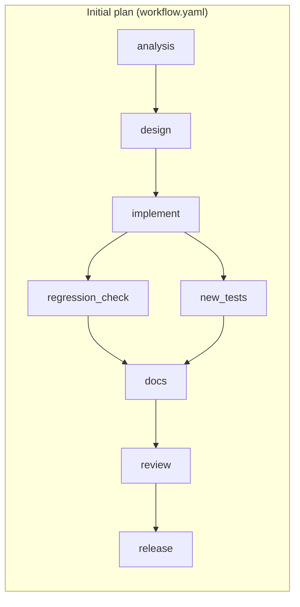
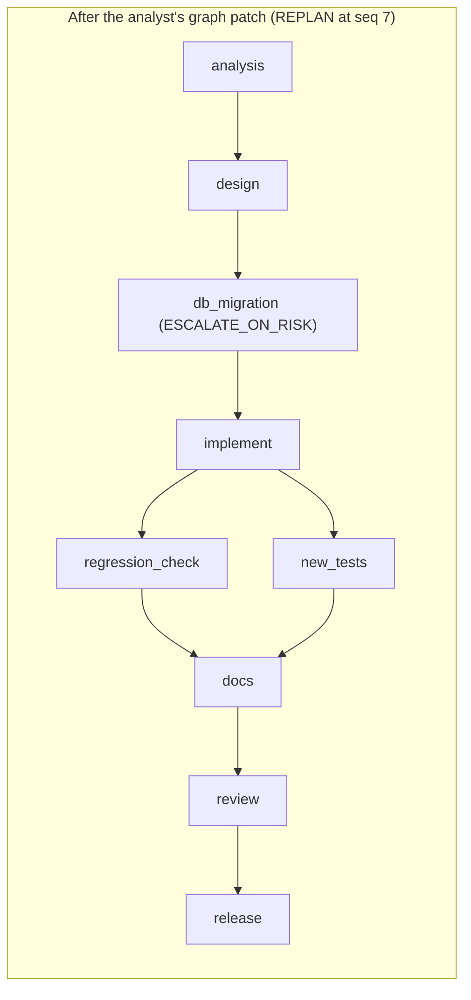

# Scenario: Brownfield ("Links must be able to expire")

Run it with `make demo-brownfield`. Full sample output: [sample-runs/brownfield/report.md](../sample-runs/brownfield/report.md). Definition: [scenarios/brownfield/workflow.yaml](../../scenarios/brownfield/workflow.yaml).

## Requirement

> Links must be able to expire. Creating a link may specify an optional expiry instant; after it passes, redirects must fail with 410 Gone. Links without an expiry must behave exactly as they do today.

The workspace is a copy of `shortener-service` (v1).

## Decomposition, before and after re-planning

## Codebase reasoning

`analysis` runs `CodebaseAnalystAgent`. It performs a **real JavaParser scan** of the workspace, recording types, imports and Spring routes, including `POST /api/v1/links`, `GET /{code:[A-Za-z0-9_-]{3,32}}` and `GET /api/v1/links/{code}/stats`. The requirement-to-file impact mapping comes from the fixture, and the `impact-files-exist` gate checks every claimed Java file against the real scan. The impact report lists 12 entries with reasons, including `ShortLink`, `LinkRepository`, `JdbcLinkRepository`, the `LinkController` redirect path, `ShortenerService`, `ErrorCode`, `ApiExceptionHandler`, `V1__init.sql`, `openapi.yaml`, and the v1 integration tests.

The analyst also returns a **graph patch** with its reason ("schema change detected ... gated by schema validation, the full regression suite and a human approval"). The engine validates it (acyclic, known agents and gates, no change to settled nodes) and records `REPLAN`.

## What happens

| Seq | Event | Why it matters |
|---|---|---|
| 5 to 7 | impact-files-exist passes; NODE_DONE; **REPLAN (graph patch)** | `db_migration` inserted between design and implement |
| 8 to 15 | design (ESCALATE_ON_RISK) auto-promotes | Small contract and doc change; no risk rule fired |
| 16 to 23 | `db_migration` runs schema-valid and **regression-tests** with V2 applied, then APPROVAL_REQUESTED | **MigrationPathRule** escalates |
| 25 | APPROVED by `demo-reviewer` ("Additive nullable column; no backfill") | |
| 30 to 38 | `implement` attempt 1: compile passes, **regression-tests fails** | Real v1 test failure: `Status expected:<302> but was:<410>` (null expiry treated as expired) |
| 39 | ATTEMPT_DISCARDED | Workspace untouched; the failure text becomes feedback |
| 40 to 49 | attempt 2 uses `ShortLink.isExpiredAt` (null means never expires); all gates pass; NODE_DONE | Auto-promoted: no pom, migration or large-diff risk |
| 50 to 61 | `regression_check` and `new_tests` run in parallel | Full v1 suite, plus the new expiry tests |
| 68 to 72 | review re-runs the whole suite, GO | |
| 73 onward | release: review-go, approval, done | |

## Approvals

| Node | Approver | Reason required |
|---|---|---|
| db_migration | demo-reviewer | MigrationPathRule (`V2__add_expiry.sql`) |
| release | demo-reviewer | APPROVE_AFTER |

## Metrics (sample run)

9 nodes in the final graph, 8 first-pass (88.9%). **1 retry and 1 rollback** (implement), MTTR about 4.5 s, 2 approvals, **1 replan**, 0 invalidations, gate failures `{regression-tests: 1}`.

## Outputs

`V2__add_expiry.sql` (nullable `expires_at`, no backfill); expiry support in the model, repository, service, controller and error mapping; `openapi.yaml` 1.1.0 with `expiresAt` and `410`; `LinkExpiryIntegrationTest` and `ShortLinkExpiryTest`; README, `docs/design-expiry.md`, release notes.

## Validation

`BrownfieldScenarioTest` asserts the real routes in the scan, the impacted files, the patch (`implement` now depends on `db_migration`), the migration escalation reason, exactly one regression failure with the 302/410 message, the final code shape, and the metrics.
