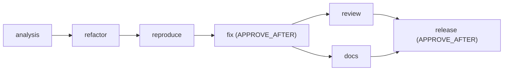

# Scenario: Bug fix ("trailing-dot hosts bypass the SSRF block")

Run it with `make demo-bugfix` (or `docker run --rm -it -v "$PWD/runs:/app/runs" agentic-sdlc demo-bugfix`). Full sample output: [sample-runs/bugfix/report.md](../sample-runs/bugfix/report.md). Definition: [scenarios/bugfix/workflow.yaml](../../scenarios/bugfix/workflow.yaml).

This scenario covers the brownfield **bug-fix** and **refactor** scope. The defect is real in the committed v1 baseline, not planted: `java.net.URI` keeps the trailing dot of an absolute DNS name, and v1's host rules compare exact strings. So `http://localhost./admin` and `http://printer.local./` are accepted, even though they resolve exactly like `localhost` and `printer.local`.

## Requirement

> Security bug report: POST /api/v1/links accepts http://localhost./admin and http://printer.local./, so a short link can redirect clients to local hosts. Fix it without changing any other behavior.

The workspace is a copy of `shortener-service` (v1).

## Decomposition

The order is the classic safe sequence: *make the change easy, then make the easy change*.

1. **analysis:** a real JavaParser scan plus an impact report (`UrlValidator`, its tests, its only caller `ShortenerService`, and an unchanged `openapi.yaml`), including the root cause and the plan.
2. **refactor:** host classification moves out of `UrlValidator` into a new `HostClassifier`, with identical logic, the defect included. The unchanged v1 suite in the `regression-tests` gate proves the move preserves behavior.
3. **reproduce:** the tester adds `TrailingDotHostTest` **before any fix exists**. The `reproduces-defect` gate runs the real `mvn test` and passes only if the build fails, the failures are assertion failures in the new test class, and no existing test breaks. A test that already passes, does not compile, or breaks other tests is rejected.
4. **fix:** attempt 1 special-cases the reported string `localhost.` only. The regression gate fails on `api.localhost.`, `printer.local.` and `nas.local.:8443`, and the attempt is rolled back. The exact failing URLs become the feedback. Attempt 2 fixes the root cause: it removes the absolute-name trailing dot once, rejects empty names and labels, and applies every rule to the canonical name. Public absolute names such as `example.com.` stay valid.
5. **review** re-runs the whole suite (GO). In parallel, **docs** writes `docs/security-notes.md`.
6. **release:** 1.0.1 notes, gated by `review-go` and a human sign-off.

## What happens (sample run)

| Seq | Event | Why it matters |
|---|---|---|
| 2 to 6 | analysis: impact-files-exist passes against the real scan | Impact claims are checked, not trusted |
| 7 to 16 | refactor: compile and **regression-tests** pass, NODE_DONE | Behavior preservation proven by the unchanged suite |
| 17 to 23 | reproduce: **reproduces-defect** passes | The new test fails on the unfixed code, so it really reproduces the bug |
| 24 to 34 | fix attempt 1: **regression-tests fails**, ATTEMPT_DISCARDED | Incomplete fix caught, workspace untouched |
| 35 to 44 | fix attempt 2: all gates pass, APPROVAL_REQUESTED | Security fix needs a human |
| 45 | APPROVED ("Root cause fixed in one place; reproduction test green") | |
| 47 to 58 | docs and review run in parallel; review GO | |
| 59 onward | release: review-go, approval, done | |

## Approvals

| Node | Approver | Reason required |
|---|---|---|
| fix | demo-reviewer | APPROVE_AFTER (security fix) |
| release | demo-reviewer | APPROVE_AFTER |

## Metrics (sample run)

7 nodes, 6 first-pass (85.7%). **1 retry and 1 rollback** (fix), 2 approvals, 0 invalidations and replans, gate failures `{regression-tests: 1}`.

## Outputs

`HostClassifier.java` (new), a slimmer `UrlValidator.java`, `TrailingDotHostTest.java`, `docs/security-notes.md` and the 1.0.1 release notes. The committed baseline is not modified: scenario output is never blessed back, so greenfield still reproduces v1 byte for byte.
