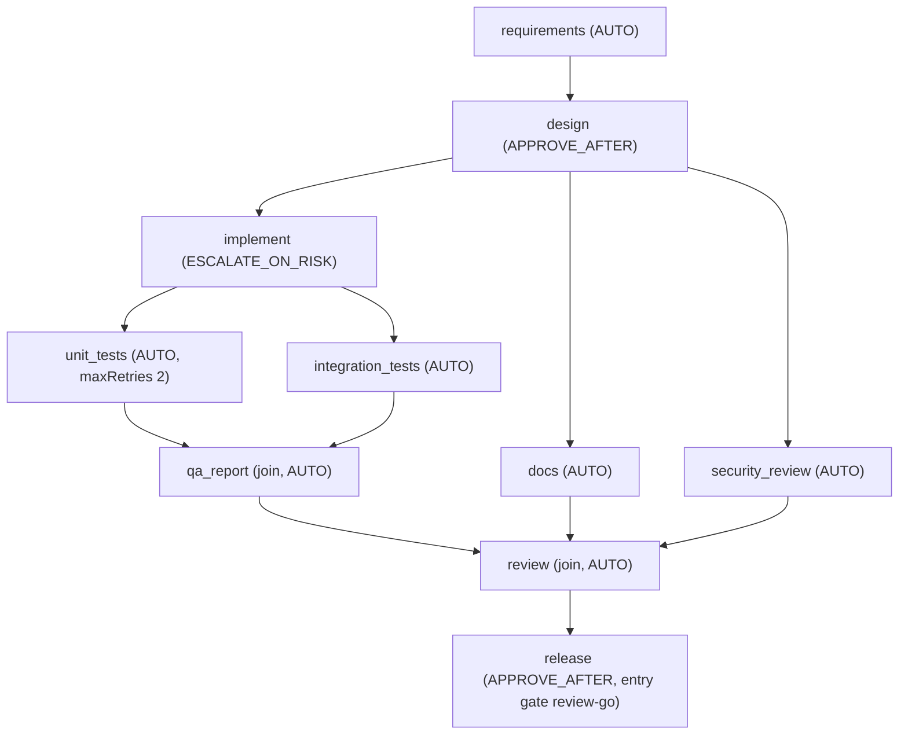

# Scenario: Greenfield ("Build the core URL shortener")

Run it with `make demo-greenfield`. Full sample output: [sample-runs/greenfield/report.md](../sample-runs/greenfield/report.md). Definition: [scenarios/greenfield/workflow.yaml](../../scenarios/greenfield/workflow.yaml).

## Requirement

> Build a URL shortener service: create short links (with an optional custom alias), redirect by code, and report click statistics. It must not become an SSRF or abuse vector, must rate-limit link creation, and must never log personal data.

The workspace starts **empty**.

## Decomposition

| Node | Output | Exit gates |
|---|---|---|
| requirements | problem statement, **6 user stories**, 9 acceptance criteria, 2 non-blocking ambiguities, recorded as assumptions | artifact-metadata, requirements-complete (stories must read "As a ..., I want ..., so that ...") |
| design | `openapi.yaml`, `V1__init.sql` (with the `audit_event` table), `docs/design.md` with a component and a sequence **Mermaid diagram**, risk list | + **design-diagrams**, path-allowlist, schema-valid, secret-scan |
| implement | `pom.xml` (with a JaCoCo coverage floor), `spotbugs-exclude.xml`, 27 main sources (error envelope, sanitized logging, **audit trail**), `application.properties` | + forbidden-api, dependency-allowlist, no-raw-ip-logging, **compile** |
| unit_tests / integration_tests | 8 unit test classes / 3 MockMvc suites | **unit-tests** (`mvn test`) |
| qa_report | the **functional coverage matrix**: every acceptance criterion mapped to the tests that prove it | **functional-coverage** (every criterion mapped, every cited test exists), **test-coverage** (JaCoCo in the sandbox against the 100% target) |
| docs, security_review | README and operations guide / threat-model findings plus GO | artifact-metadata (+ path-allowlist, secret-scan; **review-complete** for the review) |
| review | files reviewed, findings with status and resolution, GO | **review-complete** (every submitted file reviewed), **regression-tests** (the full suite on the joined workspace) |
| release | release notes | entry: **review-go** |

Every step that promotes files also becomes one commit in the run's workspace git repository, authored by the agent role, with the rationale as the message and the artifact, run and approver as trailers.

## What happens (timeline highlights from the sample run)

| Seq | Event | Why it matters |
|---|---|---|
| 11 | `design` passes **design-diagrams** | The design document carries a component and a sequence diagram |
| 15 | `design` APPROVAL_REQUESTED | APPROVE_AFTER; the reasons also list MigrationPathRule (V1 schema) and DiffSizeRule |
| 17 to 18 | APPROVED by `demo-reviewer`, then NODE_DONE with commit `9788025d4eba` | The approval is bound to hash `1d0b735a0615`; the promotion becomes a workspace commit |
| 20 to 44 | `docs`, `security_review` and `implement` run **in one wave** | Parallel branches; `security_review` passes **review-complete** (3 of 3 files); `implement` compiles with real Maven |
| 41 | `implement` APPROVAL_REQUESTED | ESCALATE_ON_RISK fired: **PomChangeRule** and **DiffSizeRule (1,350 lines)** |
| 46 to 56 | `unit_tests` and `integration_tests` in one wave; `unit-tests` **GATE_FAILED** | Real `mvn test` failure: `CodeGeneratorTest ... Expected size: 8 but was: 7` |
| 57 | ATTEMPT_DISCARDED | Staging deleted; the workspace is untouched |
| 58 to 65 | attempt 2 (fixture fixes the expectation, citing the feedback) passes, then NODE_DONE | Retry with feedback |
| 66 to 71 | `qa_report` passes **functional-coverage** (9 of 9 criteria, 32 tests) and **test-coverage** (line 100%, branch 100%) | QA evidence measured in the sandbox, every class below target named |
| 72 to 77 | `review` passes **review-complete** (46 of 46 files) and regression-tests | The join starts only after its three dependencies are DONE; the full 135-test suite runs on the combined workspace |
| 78 to 87 | `release` passes review-go, requests approval, is approved | Release readiness gate |

The greenfield `implement` escalation cites PomChangeRule and DiffSizeRule rather than MigrationPathRule, because in this plan the V1 migration is produced (and flagged) by `design`.

## Approvals

| Node | Approver | Reason required |
|---|---|---|
| design | demo-reviewer | APPROVE_AFTER + migration + diff size |
| implement | demo-reviewer | PomChangeRule + DiffSizeRule |
| release | demo-reviewer | APPROVE_AFTER |

## Metrics (sample run)

Success rate 90.0% (9 of 10 first-pass), **1 retry and 1 rollback** (unit_tests), 0 fallbacks, MTTR about 4.3 s, **3 approvals** requested and granted, 0 invalidations. The latency values in the report are machine-dependent.

## Lineage

`lineage <run> release` walks release → review → {qa_report, docs, security_review} → {unit_tests, integration_tests} → implement → design → requirements → the requirement text. The unit_tests artifact's rationale records *why* attempt 2 differs.

## Validation

`GreenfieldScenarioTest` asserts the sequence above: the pauses, the pom risk reason, parallel docs and security review, exactly one unit-test failure with the expected message, the join ordering, the three approvals, the metrics, the measured coverage and functional coverage, the complete review, the report's quality evidence, and one workspace commit per promoting step. It also asserts that the final workspace tree hash **equals `shortener-service`**, which is what `scripts/bless-baseline.sh` promotes to the committed v1.
