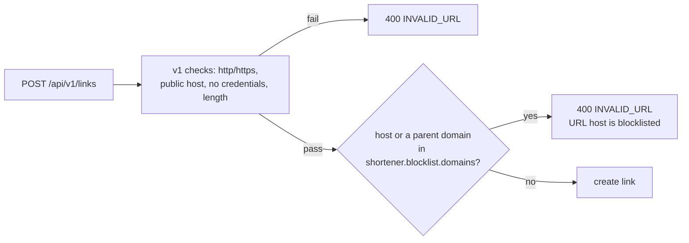

# Security hardening: destination domain blocklist

**Decision (from q-secure = domain-blocklist):** operators can block destination domains, for example known phishing or malware hosts.

- New `DomainBlocklist` component. It is configured by `shortener.blocklist.domains` (comma-separated) and matches a host exactly or any subdomain of a listed domain, case-insensitively.
- `UrlValidator` consults the blocklist after the v1 checks. A blocked host returns `400 INVALID_URL` ("URL host is blocklisted").
- The `http` and `https` schemes stay allowed, so v1 behavior is unchanged for hosts that are not blocked.

**Trade-offs:** a static list needs a restart to change, and there is no reputation feed. Both are acceptable for the prototype; a feed would replace the property source later.
