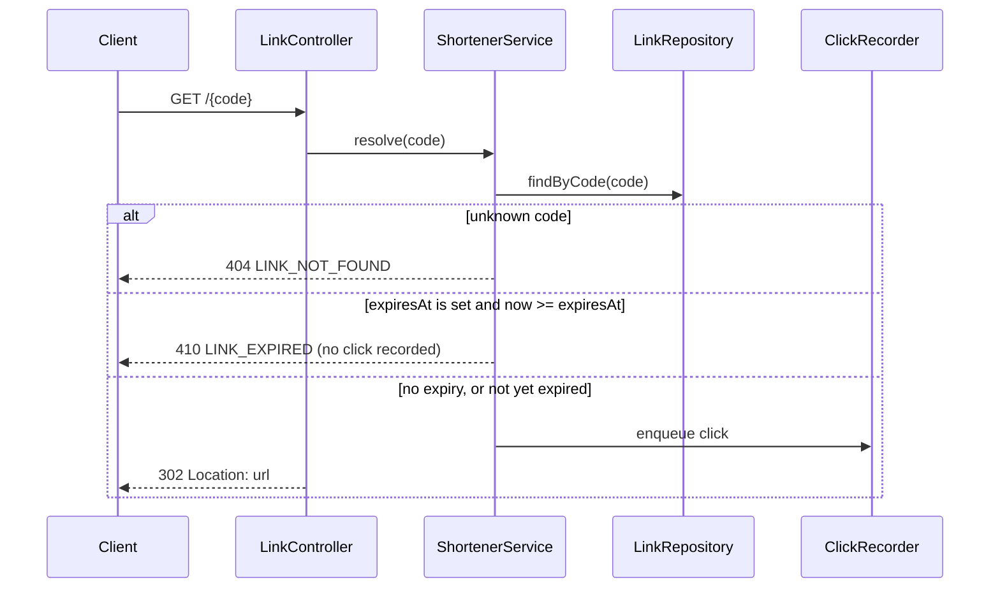

# Link expiry (v1.1): Design

## Change

`POST /api/v1/links` accepts an optional `expiresAt` (ISO-8601 instant, strictly in the future). Redirecting through an expired link returns `410 LINK_EXPIRED`. Links without `expiresAt` behave exactly as in v1.

## Impacted components

| Component | Change |
|---|---|
| `link` table | `V2__add_expiry.sql` adds nullable `expires_at` (no backfill: existing links never expire) |
| `ShortLink` | new nullable `expiresAt`; the 4-argument constructor remains for v1 callers |
| `JdbcLinkRepository` | reads and writes `expires_at` |
| `ShortenerService` | validates `expiresAt` on create (`400 INVALID_EXPIRY`), enforces it on resolve (`410 LINK_EXPIRED`) |
| `LinkController`, request/response records | pass `expiresAt` through; responses include it only when set |
| `openapi.yaml` | new fields and the `410` response |

## Decisions

1. **Nullable column, no default.** Existing rows keep `NULL`, which means "never expires", so the migration is additive and backwards compatible.
2. **Expiry is checked at redirect time using the injected clock**, and the check is `now >= expiresAt`. Expired links still report statistics.
3. **Idempotency takes expiry into account.** Re-creating the same URL with the same `expiresAt` (or with none, for a link without expiry) returns the existing link. A different expiry for an already-shortened URL returns `409 URL_ALREADY_SHORTENED`.
4. **The expired-click decision is made before a click is recorded**, so expired links do not accumulate clicks.

## Diagram

Redirecting through a link after the change:

## Risks

| Risk | Mitigation |
|---|---|
| Migration is irreversible once applied | Separate `db_migration` step with schema validation, the regression suite and human approval |
| v1 behavior regresses | `implement` is gated by the full existing test suite |
| Clock skew across instances | Single instance in this prototype; use a shared time source when scaling out |
