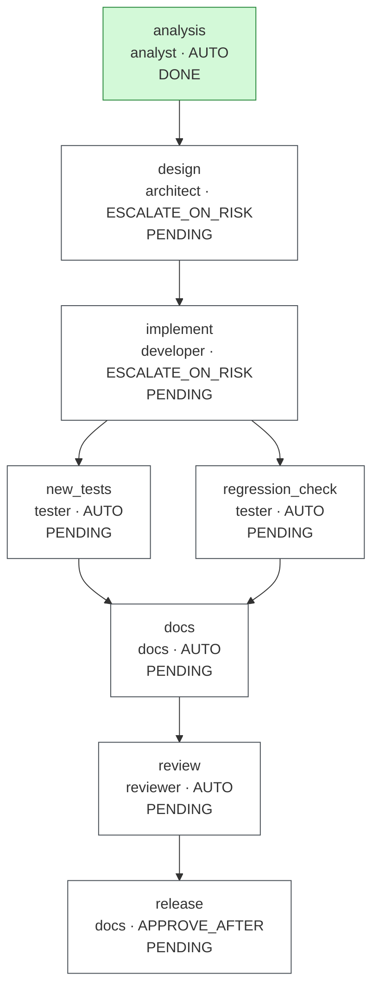
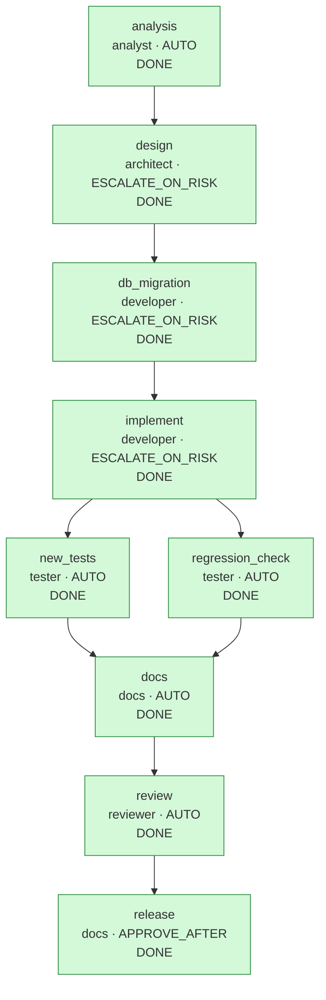

# Run report: `brownfield-20260930-000232`

## Run summary

| | |
|---|---|
| Workflow | brownfield |
| Requirement | Links must be able to expire. Creating a link may specify an optional expiry instant; after it passes, redirects must fail with 410 Gone. Links without an expiry must behave exactly as they do today. |
| Status | **COMPLETED** |
| Exit reason | all 9 nodes DONE |
| Events | 86 |
| Agent calls / attempts | 10 / 10 |

## Clarifications and assumptions

No blocking questions were raised.

## Workflow graph

### Before re-plan (state just before seq 7)

### After (final)

## Timeline

| Seq | Time (UTC) | Node | Event | Actor | Detail |
|---:|---|---|---|---|---|
| 1 | 00:02:33.577 |  | RUN_STARTED | engine | workflow brownfield |
| 2 | 00:02:33.603 | analysis | NODE_STARTED | engine | agent analyst, variant default |
| 3 | 00:02:33.795 | analysis | AGENT_CALLED | analyst | analyst attempt 1 |
| 4 | 00:02:33.808 | analysis | GATE_PASSED | engine | artifact-metadata |
| 5 | 00:02:33.810 | analysis | GATE_PASSED | engine | impact-files-exist |
| 6 | 00:02:33.824 | analysis | NODE_DONE | engine | artifact 90f6ba4a4524, 0 file(s) |
| 7 | 00:02:33.827 | analysis | REPLAN | analysis | graph-patch: Schema change detected (link.expires_at). Insert a dedicated db_migration node between design and implement so the migration is gated by schema validation, the full regression suite and a human approval before any code depen... |
| 8 | 00:02:33.838 | design | NODE_STARTED | engine | agent architect, variant default |
| 9 | 00:02:33.839 | design | GATE_PASSED | engine | path-allowlist |
| 10 | 00:02:33.841 | design | AGENT_CALLED | architect | architect attempt 1 |
| 11 | 00:02:33.852 | design | GATE_PASSED | engine | artifact-metadata |
| 12 | 00:02:33.853 | design | GATE_PASSED | engine | design-diagrams |
| 13 | 00:02:33.853 | design | GATE_PASSED | engine | path-allowlist |
| 14 | 00:02:33.857 | design | GATE_PASSED | engine | schema-valid |
| 15 | 00:02:33.861 | design | GATE_PASSED | engine | secret-scan |
| 16 | 00:02:33.948 | design | NODE_DONE | engine | artifact 56656fd4d0e6, 2 file(s), commit facbf4dbd11d |
| 17 | 00:02:33.954 | db_migration | NODE_STARTED | engine | agent developer, variant default |
| 18 | 00:02:33.954 | db_migration | GATE_PASSED | engine | path-allowlist |
| 19 | 00:02:33.956 | db_migration | AGENT_CALLED | developer | developer attempt 1 |
| 20 | 00:02:33.968 | db_migration | GATE_PASSED | engine | artifact-metadata |
| 21 | 00:02:33.969 | db_migration | GATE_PASSED | engine | path-allowlist |
| 22 | 00:02:33.976 | db_migration | GATE_PASSED | engine | schema-valid |
| 23 | 00:02:40.623 | db_migration | GATE_PASSED | engine | regression-tests |
| 24 | 00:02:40.630 | db_migration | APPROVAL_REQUESTED | engine | hash 952bdc0b4b78; [MigrationPathRule: schema migration changed (src/main/resources/db/migration/V2__add_expiry.sql)] |
| 25 | 00:02:40.641 |  | RUN_PAUSED | engine | waiting {db_migration=AWAITING_APPROVAL} |
| 26 | 00:02:42.374 | db_migration | APPROVED | demo-reviewer | by demo-reviewer on 952bdc0b4b78: Additive nullable column; no backfill |
| 27 | 00:02:42.446 | db_migration | NODE_DONE | demo-reviewer | artifact 952bdc0b4b78, 1 file(s), commit cee4f56afc0c |
| 28 | 00:02:43.104 |  | RESUMED | engine |  |
| 29 | 00:02:43.120 | implement | NODE_STARTED | engine | agent developer, variant default |
| 30 | 00:02:43.121 | implement | GATE_PASSED | engine | path-allowlist |
| 31 | 00:02:43.133 | implement | AGENT_CALLED | developer | developer attempt 1 |
| 32 | 00:02:43.151 | implement | GATE_PASSED | engine | artifact-metadata |
| 33 | 00:02:43.152 | implement | GATE_PASSED | engine | path-allowlist |
| 34 | 00:02:43.156 | implement | GATE_PASSED | engine | secret-scan |
| 35 | 00:02:43.159 | implement | GATE_PASSED | engine | forbidden-api |
| 36 | 00:02:43.159 | implement | GATE_PASSED | engine | dependency-allowlist |
| 37 | 00:02:43.160 | implement | GATE_PASSED | engine | no-raw-ip-logging |
| 38 | 00:02:44.778 | implement | GATE_PASSED | engine | compile |
| 39 | 00:02:51.019 | implement | GATE_FAILED | engine | regression-tests: mvn test failed (exit 1): LinkApiIntegrationTest.createThenRedirectReturns302WithLocation:50 Short link has expired |
| 40 | 00:02:51.030 | implement | ATTEMPT_DISCARDED | engine | rolled back attempt 1 (regression-tests, sig cdab0e7f1d25) |
| 41 | 00:02:51.039 | implement | AGENT_CALLED | developer | developer attempt 2 |
| 42 | 00:02:51.055 | implement | GATE_PASSED | engine | artifact-metadata |
| 43 | 00:02:51.056 | implement | GATE_PASSED | engine | path-allowlist |
| 44 | 00:02:51.057 | implement | GATE_PASSED | engine | secret-scan |
| 45 | 00:02:51.059 | implement | GATE_PASSED | engine | forbidden-api |
| 46 | 00:02:51.059 | implement | GATE_PASSED | engine | dependency-allowlist |
| 47 | 00:02:51.061 | implement | GATE_PASSED | engine | no-raw-ip-logging |
| 48 | 00:02:52.397 | implement | GATE_PASSED | engine | compile |
| 49 | 00:02:58.741 | implement | GATE_PASSED | engine | regression-tests |
| 50 | 00:02:58.884 | implement | NODE_DONE | engine | artifact 54841b788f10, 9 file(s), commit 2ee82a98b7f4 |
| 51 | 00:02:58.892 | new_tests | NODE_STARTED | engine | agent tester, variant default |
| 52 | 00:02:58.893 | regression_check | NODE_STARTED | engine | agent tester, variant default |
| 53 | 00:02:58.894 | regression_check | AGENT_CALLED | tester | tester attempt 1 |
| 54 | 00:02:58.895 | new_tests | AGENT_CALLED | tester | tester attempt 1 |
| 55 | 00:02:58.910 | regression_check | GATE_PASSED | engine | artifact-metadata |
| 56 | 00:02:58.910 | new_tests | GATE_PASSED | engine | artifact-metadata |
| 57 | 00:02:58.911 | new_tests | GATE_PASSED | engine | path-allowlist |
| 58 | 00:02:58.911 | new_tests | GATE_PASSED | engine | secret-scan |
| 59 | 00:03:07.146 | regression_check | GATE_PASSED | engine | regression-tests |
| 60 | 00:03:07.150 | regression_check | NODE_DONE | engine | artifact d016ae009b99, 0 file(s) |
| 61 | 00:03:07.727 | new_tests | GATE_PASSED | engine | unit-tests |
| 62 | 00:03:07.793 | new_tests | NODE_DONE | engine | artifact 1a8d835d1cc6, 2 file(s), commit b8415541b84d |
| 63 | 00:03:07.799 | docs | NODE_STARTED | engine | agent docs, variant default |
| 64 | 00:03:07.801 | docs | AGENT_CALLED | docs | docs attempt 1 |
| 65 | 00:03:07.816 | docs | GATE_PASSED | engine | artifact-metadata |
| 66 | 00:03:07.816 | docs | GATE_PASSED | engine | path-allowlist |
| 67 | 00:03:07.817 | docs | GATE_PASSED | engine | secret-scan |
| 68 | 00:03:07.871 | docs | NODE_DONE | engine | artifact 795abf6e684a, 1 file(s), commit 404e6385ef70 |
| 69 | 00:03:07.877 | review | NODE_STARTED | engine | agent reviewer, variant default |
| 70 | 00:03:07.878 | review | AGENT_CALLED | reviewer | reviewer attempt 1 |
| 71 | 00:03:07.891 | review | GATE_PASSED | engine | artifact-metadata |
| 72 | 00:03:07.892 | review | GATE_PASSED | engine | review-complete |
| 73 | 00:03:14.792 | review | GATE_PASSED | engine | regression-tests |
| 74 | 00:03:14.796 | review | NODE_DONE | engine | artifact 983a298505b3, 0 file(s) |
| 75 | 00:03:14.811 | release | NODE_STARTED | engine | agent docs, variant default |
| 76 | 00:03:14.816 | release | GATE_PASSED | engine | review-go |
| 77 | 00:03:14.820 | release | AGENT_CALLED | docs | docs attempt 1 |
| 78 | 00:03:14.836 | release | GATE_PASSED | engine | artifact-metadata |
| 79 | 00:03:14.837 | release | GATE_PASSED | engine | path-allowlist |
| 80 | 00:03:14.837 | release | GATE_PASSED | engine | secret-scan |
| 81 | 00:03:14.839 | release | APPROVAL_REQUESTED | engine | hash 7a39da3645cb; [APPROVE_AFTER: human sign-off required] |
| 82 | 00:03:14.843 |  | RUN_PAUSED | engine | waiting {release=AWAITING_APPROVAL} |
| 83 | 00:03:16.193 | release | APPROVED | demo-reviewer | by demo-reviewer on 7a39da3645cb: Review GO, v1 suite and expiry tests green: release 1.1.0 |
| 84 | 00:03:16.264 | release | NODE_DONE | demo-reviewer | artifact 7a39da3645cb, 1 file(s), commit f96b5f2c097d |
| 85 | 00:03:16.914 |  | RESUMED | engine |  |
| 86 | 00:03:16.920 |  | RUN_COMPLETED | engine |  |

## Metrics

| Metric | Value |
|---|---|
| Success rate (first-pass DONE / nodes) | 88.9% (8/9) |
| Retries (discarded attempts) | 1 {implement=1} |
| Rollbacks (staging discarded) | 1 |
| Fallbacks | 0 |
| MTTR | 7.864 s over 1 node(s) |
| End-to-end latency (gross) | 43.343 s |
| Human wait excluded | 3.098 s |
| End-to-end latency (net) | 40.244 s |
| Approvals requested / granted / rejected | 2 / 2 / 0 |
| Clarifications requested | 0 |
| Invalidations / replans | 0 / 1 |
| Gate failures by gate | {regression-tests=1} |

## Approvals

| Seq | Node | Decision | Who | When (UTC) | Hash approved | Comment | Revoked later |
|---:|---|---|---|---|---|---|---|
| 26 | db_migration | APPROVED | demo-reviewer | 00:02:42.374 | `952bdc0b4b78` | Additive nullable column; no backfill | no |
| 83 | release | APPROVED | demo-reviewer | 00:03:16.193 | `7a39da3645cb` | Review GO, v1 suite and expiry tests green: release 1.1.0 | no |

## Decision lineage

- **release** `7a39da3645cb`: Release notes for 1.1.0 (link expiry). Release readiness: review GO, full regression suite green, migration approved.
  - **review** `983a298505b3`: Reviewed the expiry change: additive migration approved, v1 suite green, new behavior covered by tests. Full suite re-run in this gate.
    - **docs** `795abf6e684a`: README documents the optional expiresAt field with an example and links the expiry design note.
      - **new_tests** `1a8d835d1cc6`: New tests for expiry: redirect before and at expiry (410), links without expiry unchanged forever, invalid expiry rejected, and idempotency with expiry. A se...
        - **implement** `54841b788f10`: The regression-tests gate showed v1 redirects returning 410: the expiry check treated a null expiresAt as expired. Resolve now uses ShortLink.isExpiredAt, wh...
          - **design** `56656fd4d0e6`: Additive, backwards-compatible design: nullable expires_at, 410 on expired redirects, 400 for past expiry, contract updated. Idempotency and statistics seman...
            - **analysis** `90f6ba4a4524`: Expiry touches the persisted model, the redirect path and the public contract. The scan confirms every file below exists; the schema change is irreversible o...
              - requirement: "Links must be able to expire. Creating a link may specify an optional expiry instant; after it passes, redirects must fail with 410 Gone. Links without an ex..."
          - **db_migration** `952bdc0b4b78`: Additive migration adding a nullable expires_at column. No backfill and no default, so every existing link keeps v1 semantics.
            - **design** `56656fd4d0e6` (see above)
        - **design** `56656fd4d0e6` (see above)
      - **regression_check** `d016ae009b99`: Re-runs the complete pre-existing suite against the promoted implementation to prove v1 behavior is unchanged.
        - **implement** `54841b788f10` (see above)

Artifacts by node:

| Node | Artifact | Files | Rationale |
|---|---|---:|---|
| analysis | `90f6ba4a4524` | 0 | Expiry touches the persisted model, the redirect path and the public contract. The scan confirms every file below exists; the schema change is irreversible once deployed, so it is split into its own governed db_migration step ahead of im... |
| design | `56656fd4d0e6` | 2 | Additive, backwards-compatible design: nullable expires_at, 410 on expired redirects, 400 for past expiry, contract updated. Idempotency and statistics semantics are specified explicitly. |
| db_migration | `952bdc0b4b78` | 1 | Additive migration adding a nullable expires_at column. No backfill and no default, so every existing link keeps v1 semantics. |
| implement | `54841b788f10` | 9 | The regression-tests gate showed v1 redirects returning 410: the expiry check treated a null expiresAt as expired. Resolve now uses ShortLink.isExpiredAt, where a null expiry never expires, so v1 behavior is preserved. |
| regression_check | `d016ae009b99` | 0 | Re-runs the complete pre-existing suite against the promoted implementation to prove v1 behavior is unchanged. |
| new_tests | `1a8d835d1cc6` | 2 | New tests for expiry: redirect before and at expiry (410), links without expiry unchanged forever, invalid expiry rejected, and idempotency with expiry. A separate H2 database keeps the new context isolated from v1 tests. |
| docs | `795abf6e684a` | 1 | README documents the optional expiresAt field with an example and links the expiry design note. |
| review | `983a298505b3` | 0 | Reviewed the expiry change: additive migration approved, v1 suite green, new behavior covered by tests. Full suite re-run in this gate. |
| release | `7a39da3645cb` | 1 | Release notes for 1.1.0 (link expiry). Release readiness: review GO, full regression suite green, migration approved. |

## Quality evidence

### Design documents

| Node | Document | Mermaid diagrams |
|---|---|---:|
| `design` | `docs/design-expiry.md` | 1 |

### Code review (`review`): GO

Reviewed 15 of 15 submitted files.

| Severity | File | Finding | Status | Resolution |
|---|---|---|---|---|
| LOW | `src/main/java/com/example/shortener/service/ShortenerService.java` | Expired links remain in storage; add a cleanup job if volume grows | DEFERRED | Follow-up: add a cleanup job when link volume grows; expired links cost only storage and are never served. |

### Workspace git history

Each promotion is one commit in the run's workspace (`git log` there shows the rationale and trailers).

| Seq | Node | Commit | Files | Approved by |
|---|---|---|---:|---|
| 16 | `design` | `facbf4dbd11d` | 2 | - |
| 27 | `db_migration` | `cee4f56afc0c` | 1 | demo-reviewer |
| 50 | `implement` | `2ee82a98b7f4` | 9 | - |
| 62 | `new_tests` | `b8415541b84d` | 2 | - |
| 68 | `docs` | `404e6385ef70` | 1 | - |
| 84 | `release` | `f96b5f2c097d` | 1 | demo-reviewer |

## Policy and gate results

| Gate | Passed | Failed |
|---|---:|---:|
| artifact-metadata | 10 | 0 |
| compile | 2 | 0 |
| dependency-allowlist | 2 | 0 |
| design-diagrams | 1 | 0 |
| forbidden-api | 2 | 0 |
| impact-files-exist | 1 | 0 |
| no-raw-ip-logging | 2 | 0 |
| path-allowlist | 10 | 0 |
| regression-tests | 4 | 1 |
| review-complete | 1 | 0 |
| review-go | 1 | 0 |
| schema-valid | 2 | 0 |
| secret-scan | 6 | 0 |
| unit-tests | 1 | 0 |

Failures:

- seq 39 `implement` / `regression-tests`: mvn test failed (exit 1): ⏎ [ERROR] Tests run: 22, Failures: 0, Errors: 1, Skipped: 0, Time elapsed: 0.672 s <<< FAILURE! -- in com.example.shortener.service.ShortenerServiceTest ⏎ [ERROR] com.example.shortener.service.ShortenerServiceTe...

## Invalidation and replan history

| Seq | Event | Node | Detail |
|---:|---|---|---|
| 7 | REPLAN | analysis | graph-patch: Schema change detected (link.expires_at). Insert a dedicated db_migration node between design and implement so the migration is gated by schema validation, the full regression suite and a human approval before any code depen... |
