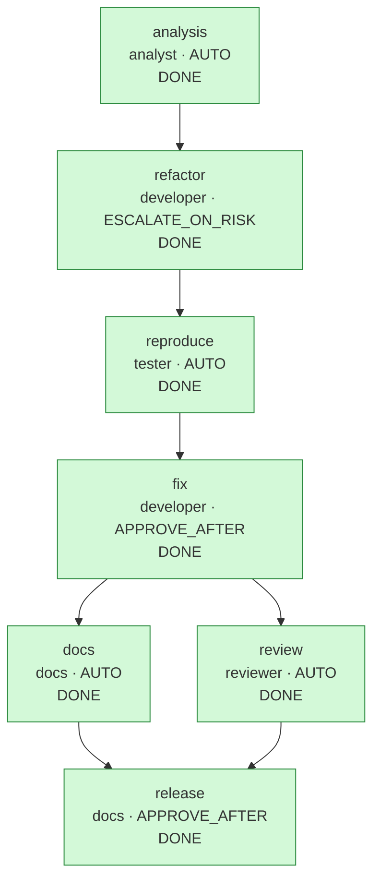

# Run report: `bugfix-20260930-001537`

## Run summary

| | |
|---|---|
| Workflow | bugfix |
| Requirement | Security bug report: POST /api/v1/links accepts http://localhost./admin and http://printer.local./, so a short link can redirect clients to local hosts. Fix it without changing any other behavior. |
| Status | **COMPLETED** |
| Exit reason | all 7 nodes DONE |
| Events | 71 |
| Agent calls / attempts | 8 / 8 |

## Clarifications and assumptions

No blocking questions were raised.

## Workflow graph

## Timeline

| Seq | Time (UTC) | Node | Event | Actor | Detail |
|---:|---|---|---|---|---|
| 1 | 00:15:38.606 |  | RUN_STARTED | engine | workflow bugfix |
| 2 | 00:15:38.630 | analysis | NODE_STARTED | engine | agent analyst, variant default |
| 3 | 00:15:38.811 | analysis | AGENT_CALLED | analyst | analyst attempt 1 |
| 4 | 00:15:38.833 | analysis | GATE_PASSED | engine | artifact-metadata |
| 5 | 00:15:38.834 | analysis | GATE_PASSED | engine | impact-files-exist |
| 6 | 00:15:38.844 | analysis | NODE_DONE | engine | artifact eeb8f2ebe479, 0 file(s) |
| 7 | 00:15:38.856 | refactor | NODE_STARTED | engine | agent developer, variant default |
| 8 | 00:15:38.856 | refactor | GATE_PASSED | engine | path-allowlist |
| 9 | 00:15:38.858 | refactor | AGENT_CALLED | developer | developer attempt 1 |
| 10 | 00:15:38.880 | refactor | GATE_PASSED | engine | artifact-metadata |
| 11 | 00:15:38.880 | refactor | GATE_PASSED | engine | path-allowlist |
| 12 | 00:15:38.884 | refactor | GATE_PASSED | engine | secret-scan |
| 13 | 00:15:38.886 | refactor | GATE_PASSED | engine | forbidden-api |
| 14 | 00:15:40.516 | refactor | GATE_PASSED | engine | compile |
| 15 | 00:15:47.115 | refactor | GATE_PASSED | engine | regression-tests |
| 16 | 00:15:47.276 | refactor | NODE_DONE | engine | artifact 114649da877e, 2 file(s), commit 787209b4ac7e |
| 17 | 00:15:47.283 | reproduce | NODE_STARTED | engine | agent tester, variant default |
| 18 | 00:15:47.285 | reproduce | AGENT_CALLED | tester | tester attempt 1 |
| 19 | 00:15:47.297 | reproduce | GATE_PASSED | engine | artifact-metadata |
| 20 | 00:15:47.297 | reproduce | GATE_PASSED | engine | path-allowlist |
| 21 | 00:15:47.297 | reproduce | GATE_PASSED | engine | secret-scan |
| 22 | 00:15:53.567 | reproduce | GATE_PASSED | engine | reproduces-defect |
| 23 | 00:15:53.650 | reproduce | NODE_DONE | engine | artifact d7604889ea84, 1 file(s), commit f201e8c61539 |
| 24 | 00:15:53.665 | fix | NODE_STARTED | engine | agent developer, variant default |
| 25 | 00:15:53.668 | fix | GATE_PASSED | engine | path-allowlist |
| 26 | 00:15:53.676 | fix | AGENT_CALLED | developer | developer attempt 1 |
| 27 | 00:15:53.697 | fix | GATE_PASSED | engine | artifact-metadata |
| 28 | 00:15:53.698 | fix | GATE_PASSED | engine | path-allowlist |
| 29 | 00:15:53.698 | fix | GATE_PASSED | engine | secret-scan |
| 30 | 00:15:53.698 | fix | GATE_PASSED | engine | forbidden-api |
| 31 | 00:15:53.699 | fix | GATE_PASSED | engine | no-raw-ip-logging |
| 32 | 00:15:55.022 | fix | GATE_PASSED | engine | compile |
| 33 | 00:16:01.567 | fix | GATE_FAILED | engine | regression-tests: mvn test failed (exit 1): TrailingDotHostTest.absoluteNamesOfLocalHostsAreRejected:21 http://api.localhost./ must be rejected ==> Expected com.example.shortener.service.ShortenerException to be thrown, but nothing was t... |
| 34 | 00:16:01.579 | fix | ATTEMPT_DISCARDED | engine | rolled back attempt 1 (regression-tests, sig 6241be0d721c) |
| 35 | 00:16:01.584 | fix | AGENT_CALLED | developer | developer attempt 2 |
| 36 | 00:16:01.599 | fix | GATE_PASSED | engine | artifact-metadata |
| 37 | 00:16:01.599 | fix | GATE_PASSED | engine | path-allowlist |
| 38 | 00:16:01.600 | fix | GATE_PASSED | engine | secret-scan |
| 39 | 00:16:01.600 | fix | GATE_PASSED | engine | forbidden-api |
| 40 | 00:16:01.601 | fix | GATE_PASSED | engine | no-raw-ip-logging |
| 41 | 00:16:03.201 | fix | GATE_PASSED | engine | compile |
| 42 | 00:16:09.352 | fix | GATE_PASSED | engine | regression-tests |
| 43 | 00:16:09.356 | fix | APPROVAL_REQUESTED | engine | hash 24021f365dc4; [APPROVE_AFTER: human sign-off required] |
| 44 | 00:16:09.368 |  | RUN_PAUSED | engine | waiting {fix=AWAITING_APPROVAL} |
| 45 | 00:16:10.620 | fix | APPROVED | demo-reviewer | by demo-reviewer on 24021f365dc4: Root cause fixed in one place; reproduction test green |
| 46 | 00:16:10.689 | fix | NODE_DONE | demo-reviewer | artifact 24021f365dc4, 1 file(s), commit c1cae82fe177 |
| 47 | 00:16:11.311 |  | RESUMED | engine |  |
| 48 | 00:16:11.325 | docs | NODE_STARTED | engine | agent docs, variant default |
| 49 | 00:16:11.326 | review | NODE_STARTED | engine | agent reviewer, variant default |
| 50 | 00:16:11.334 | review | AGENT_CALLED | reviewer | reviewer attempt 1 |
| 51 | 00:16:11.336 | docs | AGENT_CALLED | docs | docs attempt 1 |
| 52 | 00:16:11.351 | review | GATE_PASSED | engine | artifact-metadata |
| 53 | 00:16:11.352 | docs | GATE_PASSED | engine | artifact-metadata |
| 54 | 00:16:11.352 | review | GATE_PASSED | engine | review-complete |
| 55 | 00:16:11.352 | docs | GATE_PASSED | engine | path-allowlist |
| 56 | 00:16:11.353 | docs | GATE_PASSED | engine | secret-scan |
| 57 | 00:16:11.423 | docs | NODE_DONE | engine | artifact 444dd207eed2, 1 file(s), commit a022e8086601 |
| 58 | 00:16:18.002 | review | GATE_PASSED | engine | regression-tests |
| 59 | 00:16:18.007 | review | NODE_DONE | engine | artifact 7ad3e5a74fdc, 0 file(s) |
| 60 | 00:16:18.026 | release | NODE_STARTED | engine | agent docs, variant default |
| 61 | 00:16:18.031 | release | GATE_PASSED | engine | review-go |
| 62 | 00:16:18.033 | release | AGENT_CALLED | docs | docs attempt 1 |
| 63 | 00:16:18.050 | release | GATE_PASSED | engine | artifact-metadata |
| 64 | 00:16:18.051 | release | GATE_PASSED | engine | path-allowlist |
| 65 | 00:16:18.051 | release | GATE_PASSED | engine | secret-scan |
| 66 | 00:16:18.053 | release | APPROVAL_REQUESTED | engine | hash 992a04595176; [APPROVE_AFTER: human sign-off required] |
| 67 | 00:16:18.054 |  | RUN_PAUSED | engine | waiting {release=AWAITING_APPROVAL} |
| 68 | 00:16:19.207 | release | APPROVED | demo-reviewer | by demo-reviewer on 992a04595176: Review GO, full suite green: release 1.0.1 |
| 69 | 00:16:19.274 | release | NODE_DONE | demo-reviewer | artifact 992a04595176, 1 file(s), commit 8f0fe9df6381 |
| 70 | 00:16:19.875 |  | RESUMED | engine |  |
| 71 | 00:16:19.880 |  | RUN_COMPLETED | engine |  |

## Metrics

| Metric | Value |
|---|---|
| Success rate (first-pass DONE / nodes) | 85.7% (6/7) |
| Retries (discarded attempts) | 1 {fix=1} |
| Rollbacks (staging discarded) | 1 |
| Fallbacks | 0 |
| MTTR | 9.122 s over 1 node(s) |
| End-to-end latency (gross) | 41.274 s |
| Human wait excluded | 2.418 s |
| End-to-end latency (net) | 38.855 s |
| Approvals requested / granted / rejected | 2 / 2 / 0 |
| Clarifications requested | 0 |
| Invalidations / replans | 0 / 0 |
| Gate failures by gate | {regression-tests=1} |

## Approvals

| Seq | Node | Decision | Who | When (UTC) | Hash approved | Comment | Revoked later |
|---:|---|---|---|---|---|---|---|
| 45 | fix | APPROVED | demo-reviewer | 00:16:10.620 | `24021f365dc4` | Root cause fixed in one place; reproduction test green | no |
| 68 | release | APPROVED | demo-reviewer | 00:16:19.207 | `992a04595176` | Review GO, full suite green: release 1.0.1 | no |

## Decision lineage

- **release** `992a04595176`: Release notes for 1.0.1 (security fix). Release readiness: reproduction test green, full regression suite green, review GO.
  - **review** `7ad3e5a74fdc`: Security review of the fix: root cause addressed in one place, reproduction test now green, refactor proven behavior-preserving by the unchanged suite, full ...
    - **fix** `24021f365dc4`: The first attempt special-cased the reported string, and the regression test showed api.localhost. and printer.local. still pass. The root cause is that ever...
      - **reproduce** `d7604889ea84`: Regression test written before the fix. It must fail on the current code (the reproduces-defect gate checks that it fails, compiles, and breaks nothing else)...
        - **analysis** `eeb8f2ebe479`: The report reproduces on v1: java.net.URI keeps the trailing dot of an absolute DNS name, and the host rules compare exact strings, so localhost. and *.local...
          - requirement: "Security bug report: POST /api/v1/links accepts http://localhost./admin and http://printer.local./, so a short link can redirect clients to local hosts. Fix ..."
        - **refactor** `114649da877e`: Behavior-preserving extraction: host classification moves from UrlValidator into HostClassifier with identical logic (the defect included, on purpose), so th...
          - **analysis** `eeb8f2ebe479` (see above)
      - **refactor** `114649da877e` (see above)
  - **docs** `444dd207eed2`: Documents the host rules, including the absolute-name case the fix covers, for API clients and reviewers.
    - **fix** `24021f365dc4` (see above)

Artifacts by node:

| Node | Artifact | Files | Rationale |
|---|---|---:|---|
| analysis | `eeb8f2ebe479` | 0 | The report reproduces on v1: java.net.URI keeps the trailing dot of an absolute DNS name, and the host rules compare exact strings, so localhost. and *.local. pass while resolving to the same loopback or LAN hosts. The rules are private ... |
| refactor | `114649da877e` | 2 | Behavior-preserving extraction: host classification moves from UrlValidator into HostClassifier with identical logic (the defect included, on purpose), so the fix becomes a single-class change. The full existing suite runs unchanged in t... |
| reproduce | `d7604889ea84` | 1 | Regression test written before the fix. It must fail on the current code (the reproduces-defect gate checks that it fails, compiles, and breaks nothing else), and it also pins that public absolute names such as example.com. stay valid. |
| fix | `24021f365dc4` | 1 | The first attempt special-cased the reported string, and the regression test showed api.localhost. and printer.local. still pass. The root cause is that every rule sees the raw host: now the absolute-name trailing dot is removed once, em... |
| review | `7ad3e5a74fdc` | 0 | Security review of the fix: root cause addressed in one place, reproduction test now green, refactor proven behavior-preserving by the unchanged suite, full suite re-run in this gate. |
| docs | `444dd207eed2` | 1 | Documents the host rules, including the absolute-name case the fix covers, for API clients and reviewers. |
| release | `992a04595176` | 1 | Release notes for 1.0.1 (security fix). Release readiness: reproduction test green, full regression suite green, review GO. |

## Quality evidence

### Code review (`review`): GO

Reviewed 3 of 3 submitted files.

| Severity | File | Finding | Status | Resolution |
|---|---|---|---|---|
| LOW | `src/main/java/com/example/shortener/service/HostClassifier.java` | DNS rebinding remains out of scope (names are not resolved); unchanged documented limitation | ACCEPTED | Unchanged documented limitation; the fix neither widens nor narrows it. |

### Workspace git history

Each promotion is one commit in the run's workspace (`git log` there shows the rationale and trailers).

| Seq | Node | Commit | Files | Approved by |
|---|---|---|---:|---|
| 16 | `refactor` | `787209b4ac7e` | 2 | - |
| 23 | `reproduce` | `f201e8c61539` | 1 | - |
| 46 | `fix` | `c1cae82fe177` | 1 | demo-reviewer |
| 57 | `docs` | `a022e8086601` | 1 | - |
| 69 | `release` | `8f0fe9df6381` | 1 | demo-reviewer |

## Policy and gate results

| Gate | Passed | Failed |
|---|---:|---:|
| artifact-metadata | 8 | 0 |
| compile | 3 | 0 |
| forbidden-api | 3 | 0 |
| impact-files-exist | 1 | 0 |
| no-raw-ip-logging | 2 | 0 |
| path-allowlist | 8 | 0 |
| regression-tests | 3 | 1 |
| reproduces-defect | 1 | 0 |
| review-complete | 1 | 0 |
| review-go | 1 | 0 |
| secret-scan | 6 | 0 |

Failures:

- seq 33 `fix` / `regression-tests`: mvn test failed (exit 1): ⏎ [ERROR] Tests run: 6, Failures: 3, Errors: 0, Skipped: 0, Time elapsed: 0.011 s <<< FAILURE! -- in com.example.shortener.service.TrailingDotHostTest ⏎ [ERROR] com.example.shortener.service.TrailingDotHostTest....

## Invalidation and replan history

| Seq | Event | Node | Detail |
|---:|---|---|---|
| | none | | |
