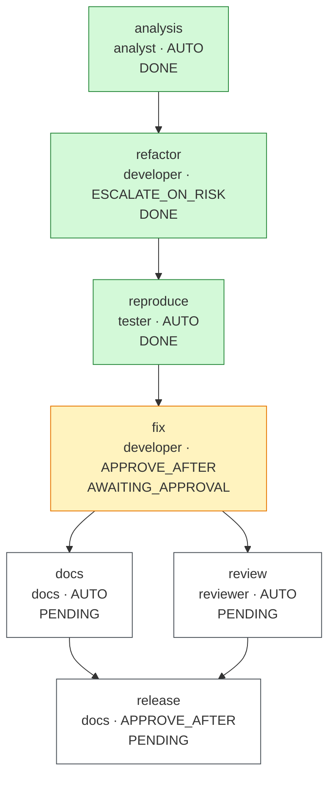

# Run report: `live-smoke-20260929-124245`

## Run summary

| | |
|---|---|
| Workflow | bugfix |
| Requirement | Security bug report: POST /api/v1/links accepts http://localhost./admin and http://printer.local./, so a short link can redirect clients to local hosts. Fix it without changing any other behavior. |
| Status | **PAUSED** |
| Exit reason | paused awaiting human: {fix=AWAITING_APPROVAL} |
| Events | 64 |
| Agent calls / attempts | 13 / 13 |

## Clarifications and assumptions

No blocking questions were raised.

## Workflow graph

## Timeline

| Seq | Time (UTC) | Node | Event | Actor | Detail |
|---:|---|---|---|---|---|
| 1 | 12:42:45.745 |  | RUN_STARTED | engine | workflow bugfix |
| 2 | 12:42:45.772 | analysis | NODE_STARTED | engine | agent analyst, variant default |
| 3 | 12:42:46.168 | analysis | AGENT_CALLED | analyst | analyst attempt 1 (0 in / 0 out tokens, 0.2 s) error: model call returned HTTP 401 (authentication_error) |
| 4 | 12:42:46.178 | analysis | ATTEMPT_DISCARDED | engine | rolled back attempt 1 (agent, sig 8ffd002833d3) |
| 5 | 12:42:46.326 | analysis | AGENT_CALLED | analyst | analyst attempt 2 (0 in / 0 out tokens, 0.1 s) error: model call returned HTTP 401 (authentication_error) |
| 6 | 12:42:46.328 | analysis | ATTEMPT_DISCARDED | engine | rolled back attempt 2 (agent, sig 8ffd002833d3) |
| 7 | 12:42:46.328 | analysis | FALLBACK | engine | analyst → mock-analyst: circuit breaker: identical failure signature twice |
| 8 | 12:42:46.370 | analysis | AGENT_CALLED | mock-analyst | mock-analyst attempt 1 |
| 9 | 12:42:46.380 | analysis | GATE_PASSED | engine | artifact-metadata |
| 10 | 12:42:46.381 | analysis | GATE_PASSED | engine | impact-files-exist |
| 11 | 12:42:46.391 | analysis | NODE_DONE | engine | artifact 509c9fa0de12, 0 file(s) |
| 12 | 12:42:46.400 | refactor | NODE_STARTED | engine | agent developer, variant default |
| 13 | 12:42:46.400 | refactor | GATE_PASSED | engine | path-allowlist |
| 14 | 12:42:46.533 | refactor | AGENT_CALLED | developer | developer attempt 1 (0 in / 0 out tokens, 0.1 s) error: model call returned HTTP 401 (authentication_error) |
| 15 | 12:42:46.534 | refactor | ATTEMPT_DISCARDED | engine | rolled back attempt 1 (agent, sig 8ffd002833d3) |
| 16 | 12:42:46.648 | refactor | AGENT_CALLED | developer | developer attempt 2 (0 in / 0 out tokens, 0.1 s) error: model call returned HTTP 401 (authentication_error) |
| 17 | 12:42:46.649 | refactor | ATTEMPT_DISCARDED | engine | rolled back attempt 2 (agent, sig 8ffd002833d3) |
| 18 | 12:42:46.649 | refactor | FALLBACK | engine | developer → mock-developer: circuit breaker: identical failure signature twice |
| 19 | 12:42:46.651 | refactor | AGENT_CALLED | mock-developer | mock-developer attempt 1 |
| 20 | 12:42:46.662 | refactor | GATE_PASSED | engine | artifact-metadata |
| 21 | 12:42:46.663 | refactor | GATE_PASSED | engine | path-allowlist |
| 22 | 12:42:46.665 | refactor | GATE_PASSED | engine | secret-scan |
| 23 | 12:42:46.667 | refactor | GATE_PASSED | engine | forbidden-api |
| 24 | 12:42:49.320 | refactor | GATE_PASSED | engine | compile |
| 25 | 12:42:56.679 | refactor | GATE_PASSED | engine | regression-tests |
| 26 | 12:42:56.708 | refactor | NODE_DONE | engine | artifact 114649da877e, 2 file(s) |
| 27 | 12:42:56.717 | reproduce | NODE_STARTED | engine | agent tester, variant default |
| 28 | 12:42:56.837 | reproduce | AGENT_CALLED | tester | tester attempt 1 (0 in / 0 out tokens, 0.1 s) error: model call returned HTTP 401 (authentication_error) |
| 29 | 12:42:56.838 | reproduce | ATTEMPT_DISCARDED | engine | rolled back attempt 1 (agent, sig 8ffd002833d3) |
| 30 | 12:42:56.945 | reproduce | AGENT_CALLED | tester | tester attempt 2 (0 in / 0 out tokens, 0.1 s) error: model call returned HTTP 401 (authentication_error) |
| 31 | 12:42:56.946 | reproduce | ATTEMPT_DISCARDED | engine | rolled back attempt 2 (agent, sig 8ffd002833d3) |
| 32 | 12:42:56.947 | reproduce | FALLBACK | engine | tester → mock-tester: circuit breaker: identical failure signature twice |
| 33 | 12:42:56.952 | reproduce | AGENT_CALLED | mock-tester | mock-tester attempt 1 |
| 34 | 12:42:56.969 | reproduce | GATE_PASSED | engine | artifact-metadata |
| 35 | 12:42:56.970 | reproduce | GATE_PASSED | engine | path-allowlist |
| 36 | 12:42:56.970 | reproduce | GATE_PASSED | engine | secret-scan |
| 37 | 12:43:03.977 | reproduce | GATE_PASSED | engine | reproduces-defect |
| 38 | 12:43:03.990 | reproduce | NODE_DONE | engine | artifact d7604889ea84, 1 file(s) |
| 39 | 12:43:03.996 | fix | NODE_STARTED | engine | agent developer, variant default |
| 40 | 12:43:03.997 | fix | GATE_PASSED | engine | path-allowlist |
| 41 | 12:43:04.119 | fix | AGENT_CALLED | developer | developer attempt 1 (0 in / 0 out tokens, 0.1 s) error: model call returned HTTP 401 (authentication_error) |
| 42 | 12:43:04.120 | fix | ATTEMPT_DISCARDED | engine | rolled back attempt 1 (agent, sig 8ffd002833d3) |
| 43 | 12:43:04.231 | fix | AGENT_CALLED | developer | developer attempt 2 (0 in / 0 out tokens, 0.1 s) error: model call returned HTTP 401 (authentication_error) |
| 44 | 12:43:04.232 | fix | ATTEMPT_DISCARDED | engine | rolled back attempt 2 (agent, sig 8ffd002833d3) |
| 45 | 12:43:04.233 | fix | FALLBACK | engine | developer → mock-developer: circuit breaker: identical failure signature twice |
| 46 | 12:43:04.235 | fix | AGENT_CALLED | mock-developer | mock-developer attempt 1 |
| 47 | 12:43:04.255 | fix | GATE_PASSED | engine | artifact-metadata |
| 48 | 12:43:04.255 | fix | GATE_PASSED | engine | path-allowlist |
| 49 | 12:43:04.256 | fix | GATE_PASSED | engine | secret-scan |
| 50 | 12:43:04.256 | fix | GATE_PASSED | engine | forbidden-api |
| 51 | 12:43:04.257 | fix | GATE_PASSED | engine | no-raw-ip-logging |
| 52 | 12:43:06.584 | fix | GATE_PASSED | engine | compile |
| 53 | 12:43:14.862 | fix | GATE_FAILED | engine | regression-tests: mvn test failed (exit 1): TrailingDotHostTest.absoluteNamesOfLocalHostsAreRejected:21 http://api.localhost./ must be rejected ==> Expected com.example.shortener.service.ShortenerException to be thrown, but nothing was t... |
| 54 | 12:43:14.879 | fix | ATTEMPT_DISCARDED | engine | rolled back attempt 1 (regression-tests, sig 0bb0d9c3b582) |
| 55 | 12:43:14.884 | fix | AGENT_CALLED | mock-developer | mock-developer attempt 2 |
| 56 | 12:43:14.897 | fix | GATE_PASSED | engine | artifact-metadata |
| 57 | 12:43:14.898 | fix | GATE_PASSED | engine | path-allowlist |
| 58 | 12:43:14.898 | fix | GATE_PASSED | engine | secret-scan |
| 59 | 12:43:14.899 | fix | GATE_PASSED | engine | forbidden-api |
| 60 | 12:43:14.899 | fix | GATE_PASSED | engine | no-raw-ip-logging |
| 61 | 12:43:17.941 | fix | GATE_PASSED | engine | compile |
| 62 | 12:43:33.948 | fix | GATE_PASSED | engine | regression-tests |
| 63 | 12:43:33.962 | fix | APPROVAL_REQUESTED | engine | hash 24021f365dc4; [APPROVE_AFTER: human sign-off required] |
| 64 | 12:43:33.976 |  | RUN_PAUSED | engine | waiting {fix=AWAITING_APPROVAL} |

## Metrics

| Metric | Value |
|---|---|
| Success rate (first-pass DONE / nodes) | 0.0% (0/7) |
| Retries (discarded attempts) | 9 {analysis=2, fix=3, refactor=2, reproduce=2} |
| Rollbacks (staging discarded) | 9 |
| Fallbacks | 4 |
| MTTR | n/a (no recovered failures) over 0 node(s) |
| End-to-end latency (gross) | n/a (not completed) |
| Human wait excluded | 0.013 s |
| End-to-end latency (net) | n/a (not completed) |
| Approvals requested / granted / rejected | 1 / 0 / 0 |
| Clarifications requested | 0 |
| Invalidations / replans | 0 / 0 |
| Gate failures by gate | {regression-tests=1} |
| Model calls / input tokens / output tokens / model time | 8 / 0 / 0 / 1.015 s |

## Approvals

| Seq | Node | Decision | Who | When (UTC) | Hash approved | Comment | Revoked later |
|---:|---|---|---|---|---|---|---|

## Decision lineage

Artifacts by node:

| Node | Artifact | Files | Rationale |
|---|---|---:|---|
| analysis | `509c9fa0de12` | 0 | The report reproduces on v1: java.net.URI keeps the trailing dot of an absolute DNS name, and the host rules compare exact strings, so localhost. and *.local. pass while resolving to the same loopback or LAN hosts. The rules are private ... |
| refactor | `114649da877e` | 2 | Behavior-preserving extraction: host classification moves from UrlValidator into HostClassifier with identical logic (the defect included, on purpose), so the fix becomes a single-class change. The full existing suite runs unchanged in t... |
| reproduce | `d7604889ea84` | 1 | Regression test written before the fix. It must fail on the current code (the reproduces-defect gate checks that it fails, compiles, and breaks nothing else), and it also pins that public absolute names such as example.com. stay valid. |

## Policy and gate results

| Gate | Passed | Failed |
|---|---:|---:|
| artifact-metadata | 5 | 0 |
| compile | 3 | 0 |
| forbidden-api | 3 | 0 |
| impact-files-exist | 1 | 0 |
| no-raw-ip-logging | 2 | 0 |
| path-allowlist | 6 | 0 |
| regression-tests | 2 | 1 |
| reproduces-defect | 1 | 0 |
| secret-scan | 4 | 0 |

Failures:

- seq 53 `fix` / `regression-tests`: mvn test failed (exit 1): ⏎ [ERROR] Tests run: 6, Failures: 3, Errors: 0, Skipped: 0, Time elapsed: 0.024 s <<< FAILURE! -- in com.example.shortener.service.TrailingDotHostTest ⏎ [ERROR] com.example.shortener.service.TrailingDotHostTest....

## Invalidation and replan history

| Seq | Event | Node | Detail |
|---:|---|---|---|
| | none | | |
