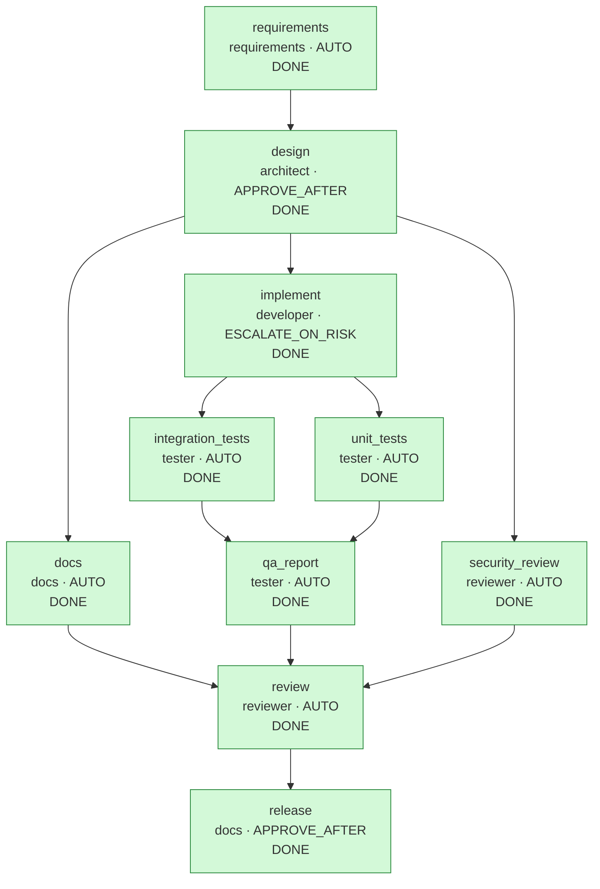

# Run report: `my-run`

## Run summary

| | |
|---|---|
| Workflow | greenfield |
| Requirement | Build a URL shortener service: create short links (with an optional custom alias), redirect by code, and report click statistics. It must not become an SSRF or abuse vector, must rate-limit link creation, and must never log personal data. |
| Status | **COMPLETED** |
| Exit reason | all 10 nodes DONE |
| Events | 89 |
| Agent calls / attempts | 11 / 11 |

## Clarifications and assumptions

No blocking questions were raised.

Recorded assumptions (`requirements`):

- Single-instance deployment: the rate limiter and click queue are in memory
- No authentication on the API in v1
- Link expiry is out of scope for v1
- q-storage: H2 with Flyway for the prototype; storage sits behind LinkRepository so it can be swapped
- q-click-overflow: Drop and count them; redirect latency matters more than exact analytics

## Workflow graph

## Timeline

| Seq | Time (UTC) | Node | Event | Actor | Detail |
|---:|---|---|---|---|---|
| 1 | 23:56:50.646 |  | RUN_STARTED | engine | workflow greenfield |
| 2 | 23:56:50.680 | requirements | NODE_STARTED | engine | agent requirements, variant default |
| 3 | 23:56:50.691 | requirements | AGENT_CALLED | requirements | requirements attempt 1 |
| 4 | 23:56:50.696 | requirements | GATE_PASSED | engine | artifact-metadata |
| 5 | 23:56:50.698 | requirements | GATE_PASSED | engine | requirements-complete |
| 6 | 23:56:50.703 | requirements | NODE_DONE | engine | artifact d1f94f38a55e, 0 file(s) |
| 7 | 23:56:50.709 | design | NODE_STARTED | engine | agent architect, variant default |
| 8 | 23:56:50.709 | design | GATE_PASSED | engine | path-allowlist |
| 9 | 23:56:50.712 | design | AGENT_CALLED | architect | architect attempt 1 |
| 10 | 23:56:50.714 | design | GATE_PASSED | engine | artifact-metadata |
| 11 | 23:56:50.716 | design | GATE_PASSED | engine | design-diagrams |
| 12 | 23:56:50.716 | design | GATE_PASSED | engine | path-allowlist |
| 13 | 23:56:50.719 | design | GATE_PASSED | engine | schema-valid |
| 14 | 23:56:50.725 | design | GATE_PASSED | engine | secret-scan |
| 15 | 23:56:50.734 | design | APPROVAL_REQUESTED | engine | hash 1d0b735a0615; [APPROVE_AFTER: human sign-off required, MigrationPathRule: schema migration changed (src/main/resources/db/migration/V1__init.sql), DiffSizeRule: 297 changed lines exceeds 200] |
| 16 | 23:56:50.737 |  | RUN_PAUSED | engine | waiting {design=AWAITING_APPROVAL} |
| 17 | 23:57:09.794 | design | APPROVED | krishna | by krishna on 1d0b735a0615: Looks good |
| 18 | 23:57:09.880 | design | NODE_DONE | krishna | artifact 1d0b735a0615, 3 file(s), commit 2b1f199396f8 |
| 19 | 23:57:17.071 |  | RESUMED | engine |  |
| 20 | 23:57:17.082 | security_review | NODE_STARTED | engine | agent reviewer, variant default |
| 21 | 23:57:17.085 | docs | NODE_STARTED | engine | agent docs, variant default |
| 22 | 23:57:17.085 | implement | NODE_STARTED | engine | agent developer, variant default |
| 23 | 23:57:17.085 | implement | GATE_PASSED | engine | path-allowlist |
| 24 | 23:57:17.093 | security_review | AGENT_CALLED | reviewer | reviewer attempt 1 |
| 25 | 23:57:17.095 | docs | AGENT_CALLED | docs | docs attempt 1 |
| 26 | 23:57:17.099 | security_review | GATE_PASSED | engine | artifact-metadata |
| 27 | 23:57:17.099 | docs | GATE_PASSED | engine | artifact-metadata |
| 28 | 23:57:17.100 | docs | GATE_PASSED | engine | path-allowlist |
| 29 | 23:57:17.100 | implement | AGENT_CALLED | developer | developer attempt 1 |
| 30 | 23:57:17.101 | security_review | GATE_PASSED | engine | review-complete |
| 31 | 23:57:17.102 | docs | GATE_PASSED | engine | secret-scan |
| 32 | 23:57:17.109 | security_review | NODE_DONE | engine | artifact 94945665bf47, 0 file(s) |
| 33 | 23:57:17.112 | implement | GATE_PASSED | engine | artifact-metadata |
| 34 | 23:57:17.113 | implement | GATE_PASSED | engine | path-allowlist |
| 35 | 23:57:17.118 | implement | GATE_PASSED | engine | secret-scan |
| 36 | 23:57:17.124 | implement | GATE_PASSED | engine | forbidden-api |
| 37 | 23:57:17.159 | implement | GATE_PASSED | engine | dependency-allowlist |
| 38 | 23:57:17.161 | implement | GATE_PASSED | engine | no-raw-ip-logging |
| 39 | 23:57:17.226 | docs | NODE_DONE | engine | artifact cd35e2d72520, 2 file(s), commit c75c809b8dbc |
| 40 | 23:57:19.050 | implement | GATE_PASSED | engine | compile |
| 41 | 23:57:19.068 | implement | APPROVAL_REQUESTED | engine | hash cfd75c228c96; [PomChangeRule: build file changed (pom.xml), DiffSizeRule: 1362 changed lines exceeds 200] |
| 42 | 23:57:19.074 |  | RUN_PAUSED | engine | waiting {implement=AWAITING_APPROVAL} |
| 43 | 23:57:42.194 | implement | APPROVED | krishna | by krishna on cfd75c228c96: Code looks good |
| 44 | 23:57:42.293 | implement | NODE_DONE | krishna | artifact cfd75c228c96, 30 file(s), commit 9cc418e908a8 |
| 45 | 23:57:50.371 |  | RESUMED | engine |  |
| 46 | 23:57:50.383 | unit_tests | NODE_STARTED | engine | agent tester, variant default |
| 47 | 23:57:50.384 | integration_tests | NODE_STARTED | engine | agent tester, variant default |
| 48 | 23:57:50.395 | integration_tests | AGENT_CALLED | tester | tester attempt 1 |
| 49 | 23:57:50.397 | unit_tests | AGENT_CALLED | tester | tester attempt 1 |
| 50 | 23:57:50.412 | integration_tests | GATE_PASSED | engine | artifact-metadata |
| 51 | 23:57:50.413 | unit_tests | GATE_PASSED | engine | artifact-metadata |
| 52 | 23:57:50.414 | integration_tests | GATE_PASSED | engine | path-allowlist |
| 53 | 23:57:50.414 | unit_tests | GATE_PASSED | engine | path-allowlist |
| 54 | 23:57:50.417 | integration_tests | GATE_PASSED | engine | secret-scan |
| 55 | 23:57:50.417 | unit_tests | GATE_PASSED | engine | secret-scan |
| 56 | 23:57:54.769 | unit_tests | GATE_FAILED | engine | unit-tests: mvn test failed (exit 1): CodeGeneratorTest.generatesSevenCharacterCodes:13 Expected size: 8 but was: 7 |
| 57 | 23:57:54.781 | unit_tests | ATTEMPT_DISCARDED | engine | rolled back attempt 1 (unit-tests, sig c93b06229350) |
| 58 | 23:57:54.790 | unit_tests | AGENT_CALLED | tester | tester attempt 2 |
| 59 | 23:57:54.804 | unit_tests | GATE_PASSED | engine | artifact-metadata |
| 60 | 23:57:54.805 | unit_tests | GATE_PASSED | engine | path-allowlist |
| 61 | 23:57:54.810 | unit_tests | GATE_PASSED | engine | secret-scan |
| 62 | 23:57:58.099 | integration_tests | GATE_PASSED | engine | unit-tests |
| 63 | 23:57:58.212 | integration_tests | NODE_DONE | engine | artifact 351b80301898, 3 file(s), commit 5e1a74cf5d95 |
| 64 | 23:57:59.913 | unit_tests | GATE_PASSED | engine | unit-tests |
| 65 | 23:57:59.987 | unit_tests | NODE_DONE | engine | artifact b559ddaea5e1, 8 file(s), commit 9d6e519d48ab |
| 66 | 23:57:59.996 | qa_report | NODE_STARTED | engine | agent tester, variant default |
| 67 | 23:57:59.999 | qa_report | AGENT_CALLED | tester | tester attempt 1 |
| 68 | 23:58:00.016 | qa_report | GATE_PASSED | engine | artifact-metadata |
| 69 | 23:58:00.024 | qa_report | GATE_PASSED | engine | functional-coverage |
| 70 | 23:58:06.922 | qa_report | GATE_PASSED | engine | test-coverage |
| 71 | 23:58:06.927 | qa_report | NODE_DONE | engine | artifact 28dfb764ac9b, 0 file(s) |
| 72 | 23:58:06.937 | review | NODE_STARTED | engine | agent reviewer, variant default |
| 73 | 23:58:06.938 | review | AGENT_CALLED | reviewer | reviewer attempt 1 |
| 74 | 23:58:06.951 | review | GATE_PASSED | engine | artifact-metadata |
| 75 | 23:58:06.953 | review | GATE_PASSED | engine | review-complete |
| 76 | 23:58:13.812 | review | GATE_PASSED | engine | regression-tests |
| 77 | 23:58:13.815 | review | NODE_DONE | engine | artifact e68b9af804af, 0 file(s) |
| 78 | 23:58:13.823 | release | NODE_STARTED | engine | agent docs, variant default |
| 79 | 23:58:13.824 | release | GATE_PASSED | engine | review-go |
| 80 | 23:58:13.826 | release | AGENT_CALLED | docs | docs attempt 1 |
| 81 | 23:58:13.839 | release | GATE_PASSED | engine | artifact-metadata |
| 82 | 23:58:13.840 | release | GATE_PASSED | engine | path-allowlist |
| 83 | 23:58:13.840 | release | GATE_PASSED | engine | secret-scan |
| 84 | 23:58:13.842 | release | APPROVAL_REQUESTED | engine | hash 793599919e3a; [APPROVE_AFTER: human sign-off required] |
| 85 | 23:58:13.850 |  | RUN_PAUSED | engine | waiting {release=AWAITING_APPROVAL} |
| 86 | 23:58:17.514 | release | APPROVED | krishna | by krishna on 793599919e3a: Ready to ship |
| 87 | 23:58:17.580 | release | NODE_DONE | krishna | artifact 793599919e3a, 1 file(s), commit 35e7d7e8f933 |
| 88 | 23:58:29.759 |  | RESUMED | engine |  |
| 89 | 23:58:29.765 |  | RUN_COMPLETED | engine |  |

## Metrics

| Metric | Value |
|---|---|
| Success rate (first-pass DONE / nodes) | 90.0% (9/10) |
| Retries (discarded attempts) | 1 {unit_tests=1} |
| Rollbacks (staging discarded) | 1 |
| Fallbacks | 0 |
| MTTR | 5.218 s over 1 node(s) |
| End-to-end latency (gross) | 99.118 s |
| Human wait excluded | 45.857 s |
| End-to-end latency (net) | 53.261 s |
| Approvals requested / granted / rejected | 3 / 3 / 0 |
| Clarifications requested | 0 |
| Invalidations / replans | 0 / 0 |
| Gate failures by gate | {unit-tests=1} |

## Approvals

| Seq | Node | Decision | Who | When (UTC) | Hash approved | Comment | Revoked later |
|---:|---|---|---|---|---|---|---|
| 17 | design | APPROVED | krishna | 23:57:09.794 | `1d0b735a0615` | Looks good | no |
| 43 | implement | APPROVED | krishna | 23:57:42.194 | `cfd75c228c96` | Code looks good | no |
| 86 | release | APPROVED | krishna | 23:58:17.514 | `793599919e3a` | Ready to ship | no |

## Decision lineage

- **release** `793599919e3a`: Release notes for 1.0.0 summarizing capabilities and known limitations; release readiness requires the GO review and a human sign-off.
  - **review** `e68b9af804af`: Joined review of implementation, tests and docs. The full suite passes in the review gate; no high-severity findings.
    - **unit_tests** `b559ddaea5e1`: The unit-tests gate showed generatesSevenCharacterCodes expecting 8 characters while the design and CodeGenerator.LENGTH specify 7. Corrected the expectation...
      - **implement** `cfd75c228c96`: Implemented the approved design: Spring Boot web + JDBC + Flyway on H2, service rules exactly as specified, and a global error envelope. The pom.xml and the ...
        - **design** `1d0b735a0615`: Layered design (api/service/domain/storage) with uniqueness enforced by the database, validation at creation time, and an asynchronous bounded click pipeline...
          - **requirements** `d1f94f38a55e`: Normalized the request into an HTTP service with three endpoints, explicit validation and abuse controls, and aggregate-only analytics. Non-blocking gaps are...
            - requirement: "Build a URL shortener service: create short links (with an optional custom alias), redirect by code, and report click statistics. It must not become an SSRF ..."
    - **integration_tests** `351b80301898`: MockMvc integration tests against a real H2 database covering create/redirect, 404, idempotency, alias conflicts, invalid input, rate limiting and per-day st...
      - **implement** `cfd75c228c96` (see above)
      - **design** `1d0b735a0615` (see above)
    - **docs** `cd35e2d72520`: Operator- and developer-facing documentation: how to run and test, configuration, observability counters and failure behavior.
      - **design** `1d0b735a0615` (see above)
    - **security_review** `94945665bf47`: Threat-model review of the approved design before implementation lands.
      - **design** `1d0b735a0615` (see above)

Artifacts by node:

| Node | Artifact | Files | Rationale |
|---|---|---:|---|
| requirements | `d1f94f38a55e` | 0 | Normalized the request into an HTTP service with three endpoints, explicit validation and abuse controls, and aggregate-only analytics. Non-blocking gaps are recorded as assumptions so design can proceed. |
| design | `1d0b735a0615` | 3 | Layered design (api/service/domain/storage) with uniqueness enforced by the database, validation at creation time, and an asynchronous bounded click pipeline. The OpenAPI contract and V1 schema make the design reviewable before code exists. |
| implement | `cfd75c228c96` | 30 | Implemented the approved design: Spring Boot web + JDBC + Flyway on H2, service rules exactly as specified, and a global error envelope. The pom.xml and the size of the change require human approval under policy. |
| unit_tests | `b559ddaea5e1` | 8 | The unit-tests gate showed generatesSevenCharacterCodes expecting 8 characters while the design and CodeGenerator.LENGTH specify 7. Corrected the expectation; all other tests unchanged. |
| integration_tests | `351b80301898` | 3 | MockMvc integration tests against a real H2 database covering create/redirect, 404, idempotency, alias conflicts, invalid input, rate limiting and per-day statistics with a controllable clock. |
| qa_report | `28dfb764ac9b` | 0 | Unit and integration suites are both in place. Every acceptance criterion maps to the tests that prove it; the test-coverage gate measures line and branch coverage and names every class below the 100% target. |
| docs | `cd35e2d72520` | 2 | Operator- and developer-facing documentation: how to run and test, configuration, observability counters and failure behavior. |
| security_review | `94945665bf47` | 0 | Threat-model review of the approved design before implementation lands. |
| review | `e68b9af804af` | 0 | Joined review of implementation, tests and docs. The full suite passes in the review gate; no high-severity findings. |
| release | `793599919e3a` | 1 | Release notes for 1.0.0 summarizing capabilities and known limitations; release readiness requires the GO review and a human sign-off. |

## Quality evidence

### User stories (`requirements`)

- As a link creator, I want to shorten a long http(s) URL, so that I can share a short, memorable link
- As a link creator, I want to choose a custom alias, so that the short link is recognizable
- As a visitor, I want a short link to redirect me to its URL immediately, so that following it feels like a normal link
- As a link owner, I want per-day click statistics for my link, so that I can see how it is used
- As the service operator, I want link creation rate-limited and unsafe targets rejected, so that the service cannot be abused for SSRF or spam
- As the service operator, I want an audit trail of every change request, so that I can trace who changed what and when without storing personal data

Acceptance criteria: 9.

### Design documents

| Node | Document | Mermaid diagrams |
|---|---|---:|
| `design` | `docs/design.md` | 2 |

### Measured evidence from gates

| Node / gate | Result |
|---|---|
| `qa_report / functional-coverage` | 9 of 9 acceptance criteria mapped to 32 existing tests |
| `qa_report / test-coverage` | line 100.0% (321/321), branch 100.0% (161/161), target 100% over 27 classes; below target (documented): com.example.shortener.ShortenerApplication (line 50.0%, branch 100.0%): main() only launches Spring Boot; tests start the application context through @SpringBootTest; com.example.shortener.service.Sha256 (line 33.3%, branch 100.0%): the NoSuchAlgorithmException handler cannot run: every Java platform must provide SHA-256 |

### Functional coverage (`qa_report`)

| Acceptance criterion | Tests |
|---|---|
| POST /api/v1/links returns 201 with {code, shortUrl, url, createdAt}; the same normalized URL without an alias returns the existing link with 200 | [LinkApiIntegrationTest#createThenRedirectReturns302WithLocation, LinkApiIntegrationTest#creatingTheSameNormalizedUrlAgainIsIdempotent, ShortenerServiceTest#returnsExistingLinkForSameNormalizedUrl] |
| Custom aliases are 3-32 chars of [A-Za-z0-9_-], reserved words api/actuator/health/stats are rejected (400), duplicates return 409 | [ShortenerServiceTest#createsLinkWithCustomAlias, ShortenerServiceTest#rejectsInvalidOrReservedAliases, LinkApiIntegrationTest#invalidAliasAndMalformedBodiesReturn400, LinkApiIntegrationTest#duplicateAliasReturns409, ShortenerServiceTest#rejectsAliasThatIsAlreadyTaken] |
| Generated codes are 7 base62 characters from SecureRandom; collisions retry up to 5 times, then 500 CODE_GENERATION_FAILED | [CodeGeneratorTest#generatesSevenCharacterCodes, CodeGeneratorTest#generatedCodesUseOnlyTheBase62Alphabet, ShortenerServiceTest#retriesGeneratedCodeAfterCollision, ShortenerServiceTest#failsWithCodeGenerationFailedAfterFiveCollisions, ApiExceptionHandlerTest#codeGenerationFailureIsA500WithItsCode] |
| URLs must be http/https, <= 2048 chars, have a host, and not target localhost, *.local, or loopback/link-local/private/unspecified literal IPs | [UrlValidatorTest#rejectsNonHttpSchemes, UrlValidatorTest#rejectsUrlsLongerThan2048Characters, UrlValidatorTest#requiresHost, UrlValidatorTest#rejectsLocalHostNames, UrlValidatorTest#rejectsNonPublicLiteralAddresses, UrlValidatorEdgeCaseTest#nonPublicAddressesAreRejected, LinkApiIntegrationTest#invalidUrlReturns400] |
| GET /{code} returns 302 with Location, or 404; the click is recorded asynchronously and never blocks the redirect | [LinkApiIntegrationTest#createThenRedirectReturns302WithLocation, LinkApiIntegrationTest#unknownCodeReturns404WithErrorEnvelope, ShortenerServiceTest#resolveEnqueuesClickWithoutWaiting, ClickRecorderTest#aFailedClickDoesNotStopTheWorker] |
| GET /api/v1/links/{code}/stats returns totalClicks, lastAccessedAt and per-UTC-day buckets, or 404 | [LinkApiIntegrationTest#statsReportTotalsLastAccessAndPerDayBuckets, LinkApiIntegrationTest#statsForUnknownCodeReturns404] |
| Link creation is rate limited per client (default 20/minute) with 429; the client key is a hash and raw IPs are never logged | [RateLimiterTest#allowsBurstUpToCapacityThenRejects, LinkApiIntegrationTest#rateLimitReturns429AfterTwentyCreatesPerMinute, AuditTrailIntegrationTest#createdAndRejectedRequestsAreAuditedWithoutPersonalData] |
| Every non-2xx/3xx response uses {"error":{"code","message"}} | [LinkApiIntegrationTest#unknownCodeReturns404WithErrorEnvelope, LinkApiIntegrationTest#unmappedRoutesAndMethodsUseTheErrorEnvelope, ApiExceptionHandlerTest#unexpectedFailuresHideTheirDetails] |
| Every state-changing request is recorded in an audit trail with its time, opaque client key, method, path and final status; reads are not recorded | [AuditTrailIntegrationTest#createdAndRejectedRequestsAreAuditedWithoutPersonalData, AuditTrailIntegrationTest#readsAreNotAudited, AuditFilterTest#recordsStateChangingRequestsWithTheirFinalStatus] |

### Code review (`security_review`): GO

Reviewed 3 of 3 submitted files.

| Severity | File | Finding | Status | Resolution |
|---|---|---|---|---|
| MEDIUM | `docs/design.md` | DNS rebinding can bypass creation-time host checks; acceptable for v1 if documented and re-validated at redirect time later | ACCEPTED | Documented as a known limitation in docs/design.md (Risks); re-validating hosts at redirect time is planned for a later version. |
| LOW | `openapi.yaml` | shortUrl derives from the Host header unless shortener.base-url is configured; set it in production | ACCEPTED | The design makes shortener.base-url the production setting; the implementation must honour it (checked in the final review). |

### Code review (`review`): GO

Reviewed 46 of 46 submitted files.

| Severity | File | Finding | Status | Resolution |
|---|---|---|---|---|
| LOW | `src/main/java/com/example/shortener/api/LinkController.java` | Security review: shortUrl must not trust the Host header in production | FIXED | LinkController uses shortener.base-url when it is set; ConfiguredBaseUrlIntegrationTest proves a spoofed Host header is ignored. |
| LOW | `src/main/java/com/example/shortener/service/ClickRecorder.java` | Dropped clicks are visible only in logs | DEFERRED | Drops are logged with a running total; export a metric when the service gains an actuator endpoint. |

### Workspace git history

Each promotion is one commit in the run's workspace (`git log` there shows the rationale and trailers).

| Seq | Node | Commit | Files | Approved by |
|---|---|---|---:|---|
| 18 | `design` | `2b1f199396f8` | 3 | krishna |
| 39 | `docs` | `c75c809b8dbc` | 2 | - |
| 44 | `implement` | `9cc418e908a8` | 30 | krishna |
| 63 | `integration_tests` | `5e1a74cf5d95` | 3 | - |
| 65 | `unit_tests` | `9d6e519d48ab` | 8 | - |
| 87 | `release` | `35e7d7e8f933` | 1 | krishna |

## Policy and gate results

| Gate | Passed | Failed |
|---|---:|---:|
| artifact-metadata | 11 | 0 |
| compile | 1 | 0 |
| dependency-allowlist | 1 | 0 |
| design-diagrams | 1 | 0 |
| forbidden-api | 1 | 0 |
| functional-coverage | 1 | 0 |
| no-raw-ip-logging | 1 | 0 |
| path-allowlist | 9 | 0 |
| regression-tests | 1 | 0 |
| requirements-complete | 1 | 0 |
| review-complete | 2 | 0 |
| review-go | 1 | 0 |
| schema-valid | 1 | 0 |
| secret-scan | 7 | 0 |
| test-coverage | 1 | 0 |
| unit-tests | 2 | 1 |

Failures:

- seq 56 `unit_tests` / `unit-tests`: mvn test failed (exit 1): ⏎ [ERROR] Tests run: 4, Failures: 1, Errors: 0, Skipped: 0, Time elapsed: 0.057 s <<< FAILURE! -- in com.example.shortener.service.CodeGeneratorTest ⏎ [ERROR] com.example.shortener.service.CodeGeneratorTest.gene...

## Invalidation and replan history

| Seq | Event | Node | Detail |
|---:|---|---|---|
| | none | | |
