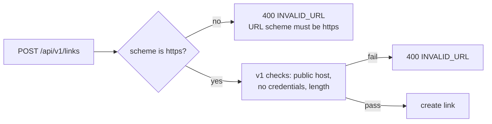

# Security hardening: HTTPS-only destinations

**Decision (from q-secure = https-only):** short links may only point at `https` URLs.

- `UrlValidator` accepts only the `https` scheme. `http` URLs are rejected with `400 INVALID_URL` ("URL scheme must be https").
- The other v1 rules are unchanged: public hosts only, no credentials, and at most 2048 characters.
- Existing `http` links keep redirecting. The rule applies when links are created, so no data migration is needed.

**Trade-off:** plain-HTTP destinations can no longer be shortened. This is an intentional, documented behavior change.
